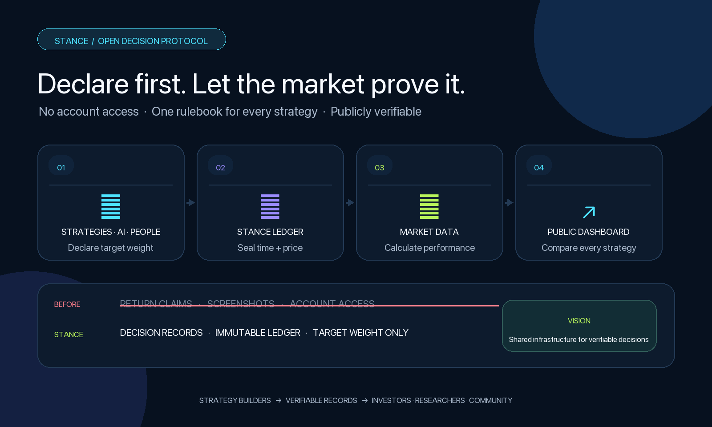
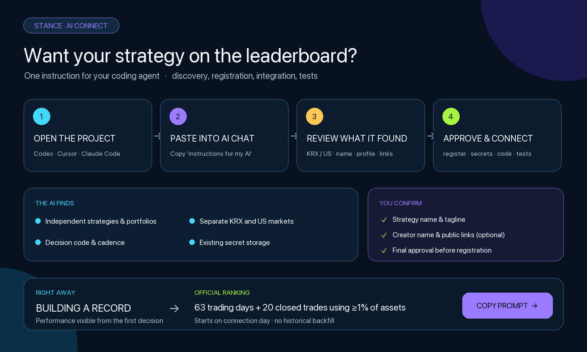
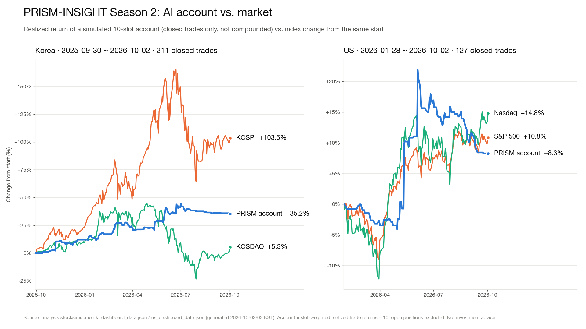
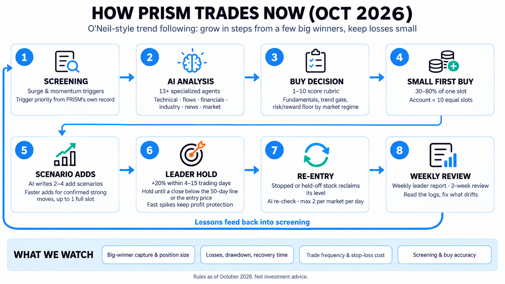
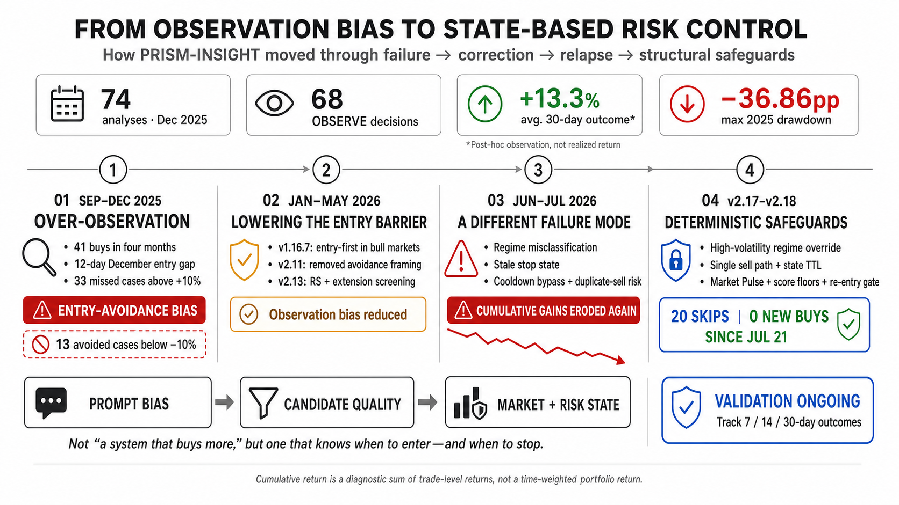
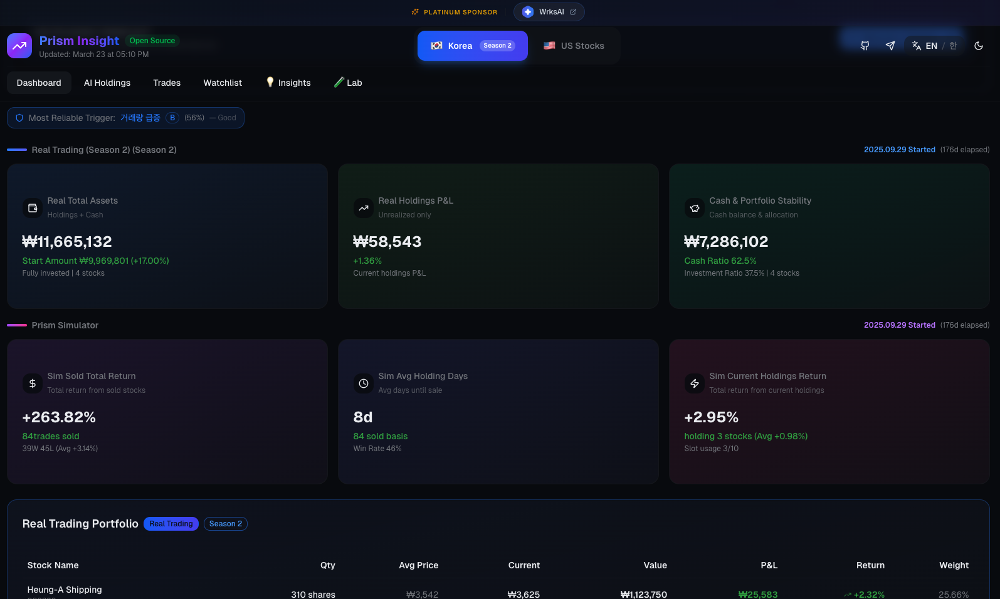
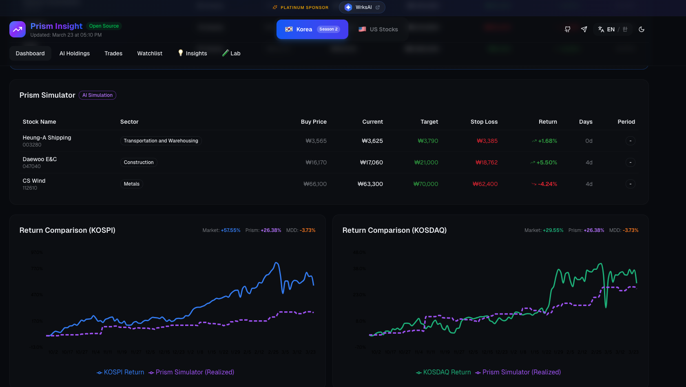
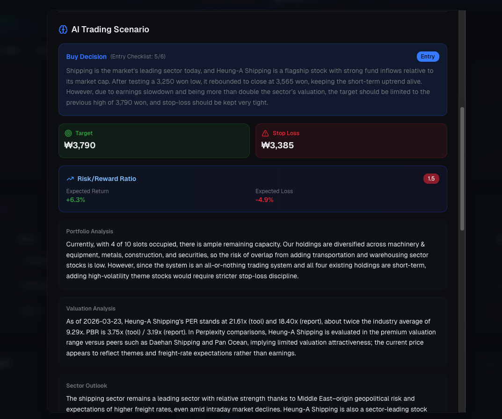

<div align="center">
  
  &nbsp;&nbsp;
  <a href="assets/characters/priso/README.md">
    
  </a>
  <br>
  <sub><strong>プリソ（Priso）</strong> · PRISM公式マスコット</sub>
  <br><br>
  
  
  
  
  
</div>

[](https://github.com/dragon1086/prism-insight/actions/workflows/ci.yml)
[](https://app.codacy.com/gh/dragon1086/prism-insight/dashboard?utm_source=gh&utm_medium=referral&utm_content=&utm_campaign=Badge_grade)

# PRISM-INSIGHT

[](https://github.com/sponsors/dragon1086)
[](https://github.com/dragon1086/prism-insight/stargazers)

> **AI駆動の株式市場分析・自動売買システム**
>
> 13以上の専門AIエージェントが連携し、急騰銘柄の検出、アナリストレベルのレポート作成、自動売買を実行します。

<p align="center">
  <a href="README.md">English</a> |
  <a href="README_ko.md">한국어</a> |
  <a href="README_ja.md">日本語</a> |
  <a href="README_zh.md">中文</a> |
  <a href="README_es.md">Español</a>
</p>

### プラチナスポンサー

<div align="center">
<a href="https://wrks.ai/en">
  
</a>

**[AI3](https://www.ai3.kr/) | [WrksAI](https://wrks.ai/en)**

プロフェッショナルのためのAIアシスタント **WrksAI** を開発する **AI3** が、<br>
投資家のためのAIアシスタント **PRISM-INSIGHT** を応援しています。
</div>

---

## NEW: Stance — いま、どのシステムトレード戦略が勝っているのか？

<p align="center">
  
</p>

**過去の実績は受け付けません。** Stanceの記録はすべて登録した瞬間から始まります。過去成績のアップロードも後付け入力もありません。その後の判断と結果が一本の公開記録として積み上がるため、都合のよい期間だけを切り取った宣伝ではなく、**戦略の本当の実力とリスク**が見えます。ランキングは韓国と米国に分かれ、リターンの横に最大下落・平均投資比率・記録率を並べて表示します。

- **いま効いている戦略を探す** — すべての戦略を同じルールで比較
- **見出しのリターンの先まで見る** — リスク、実際の投資比率、欠けた記録まで確認
- **記録の信頼性** — サーバーが判断時刻と価格を確定し、その後の結果を自動計算
- **自分の戦略も参加** — コーディングエージェントが戦略の発見から登録・連携・テストまで実行

**[ライブランキングを見る](https://analysis.stocksimulation.kr/?tab=stance)** · **[自分の戦略で参加する](https://analysis.stocksimulation.kr/?tab=stance)** · **[クイックスタート](stance/QUICKSTART.md)**

<details>
<summary><strong>自分の戦略はどうやって参加しますか？</strong></summary>

<p align="center">
  
</p>

戦略プロジェクトを **Codex CLI・Cursor・Claude Code などのコーディングエージェント** で開き、Stanceダッシュボードからコピーした指示文をチャットに貼り付けるだけです。エージェントが独立した戦略と韓国・米国のポートフォリオを見つけ、公開プロフィールに足りない項目だけを質問します。登録計画を先に提示し、承認された後にのみキーの保管・コード変更・テストまで進めます。

最初の判断から **「記録蓄積中」** に表示されます。株式の公式ランキングは、**63取引日の記録と、資産の1%以上を使った取引を20回決済した後**に始まります。記録は接続した日から始まり、過去の成績を後から追加することはできません。実口座・残高・証券会社のキーは不要です。
</details>

---

## NEW: ChatGPT Plus/Pro サブスクリプション対応

**APIキーがなくても大丈夫です。** PRISM-INSIGHTは、**Codex OAuth プロキシ**を通じて、ChatGPT Plus（月$20）またはPro（月$200）のサブスクリプションで直接分析を実行できるようになりました。

```bash
# 初回ログイン（ブラウザが自動で開きChatGPT認証）
python -m cores.chatgpt_proxy.oauth_login

# 再認証が必要な場合（アカウント切替、トークン期限切れなど）
python -m cores.chatgpt_proxy.oauth_login --force

# ChatGPTサブスクリプションで実行
PRISM_OPENAI_AUTH_MODE=chatgpt_oauth python stock_analysis_orchestrator.py --mode morning
```

> トークンはバックグラウンドで自動更新されるため、ChatGPTアカウントを変更するかパスワードを変更した場合のみ再ログインが必要です。

APIの請求ゼロ。同等の高精度分析。既存のサブスクリプションがそのまま活用できます。

---

## モバイルアプリ

<div align="center">

**AI株式分析をどこでも**

<a href="https://play.google.com/store/apps/details?id=com.prisminsight.prism_mobile">
  
</a>
<a href="https://apps.apple.com/us/app/prism-insight-stock-analysis/id6759331074">
  
</a>

</div>

- **スマートフィルタリング** — 気になるTelegramアラートだけを受け取れます
- **PDFレポート** — モバイル最適化されたAI分析レポート

---

## PRISM-INSIGHTの動作を見る

[](https://www.youtube.com/watch?v=zAywb1G0wRA)

---

## 今すぐ試す（インストール不要）

### 1. ライブダッシュボード
AIトレーディングのパフォーマンスをリアルタイムで確認できます：
**[analysis.stocksimulation.kr](https://analysis.stocksimulation.kr/)**

### 2. Telegramチャンネル
毎日の急騰銘柄アラートとAI分析レポートを受け取れます：
- **[英語チャンネル](https://t.me/prism_insight_global_en)**
- **[韓国語チャンネル](https://t.me/stock_ai_agent)**
- **[日本語チャンネル](https://t.me/prism_insight_ja)**
- **[中国語チャンネル](https://t.me/prism_insight_zh)**
- **[スペイン語チャンネル](https://t.me/prism_insight_es)**

### 3. サンプルレポート
AIが生成したApple Inc.の分析レポートをご覧ください：

[](https://youtu.be/LVOAdVCh1QE)

---

## 60秒で試す（米国株）

PRISM-INSIGHTを最も手軽に試す方法です。必要なのは **OpenAI APIキー** だけです。

```bash
# クローンしてクイックスタートスクリプトを実行
git clone https://github.com/dragon1086/prism-insight.git
cd prism-insight
./quickstart.sh YOUR_OPENAI_API_KEY
```

Apple（AAPL）のAI分析レポートが生成されます。他の銘柄も試せます：
```bash
python3 demo.py MSFT              # Microsoft
python3 demo.py NVDA              # NVIDIA
python3 demo.py TSLA --language ko  # Tesla（韓国語レポート）
```

> **OpenAI APIキーの取得**: [OpenAI Platform](https://platform.openai.com/api-keys)
>
> **任意**: ニュース分析用に [Perplexity APIキー](https://www.perplexity.ai/) を `mcp_agent.config.yaml` に追加できます
>
> **任意**: `ADANOS_API_KEY` を追加すると、米国株のニュース分析に構造化されたソーシャルセンチメント情報が加わります

AIが生成したPDFレポートは `prism-us/pdf_reports/` に保存されます。

<details>
<summary>またはDockerで実行（Python環境不要）</summary>

```bash
# 1. OpenAI APIキーを設定
export OPENAI_API_KEY=sk-your-key-here

# 2. ローカルのクイックスタートイメージをビルドして起動
docker compose -f docker-compose.quickstart.yml up --build -d

# 3. 分析を実行
docker exec -it prism-quickstart python3 demo.py NVDA
```

初回はイメージをローカルでビルドするため、数分かかる場合があります。

レポートは `./quickstart-output/` に保存されます。

</details>

---

## フルインストール

### 前提条件
- Python 3.10+ または Docker
- OpenAI APIキー（[こちらで取得](https://platform.openai.com/api-keys)）またはChatGPT Plus/Proサブスクリプション

### オプションA: Pythonでインストール

```bash
# 1. クローン & インストール
git clone https://github.com/dragon1086/prism-insight.git
cd prism-insight
pip install -r requirements.txt

# 2. PDF生成用にPlaywrightをインストール
python3 -m playwright install chromium

# 3. MCPサーバー（Firecrawl、Perplexityなど）は mcp_agent.config.yaml の設定どおり
#    npx/uv が必要時に起動 — 個別のインストールは不要

# 4. 設定
cp mcp_agent.config.yaml.example mcp_agent.config.yaml
cp mcp_agent.secrets.yaml.example mcp_agent.secrets.yaml
cp trading/config/kis_devlp.yaml.example trading/config/kis_devlp.yaml
# mcp_agent.secrets.yaml にOpenAI APIキーを入力
# trading/config/kis_devlp.yaml に韓国投資証券（KIS）のAPIキーを入力（韓国市場データ用）

# 5. 分析を実行（Telegram設定は不要！）
python stock_analysis_orchestrator.py --mode morning --no-telegram
```

米国市場の分析は次のように実行します：

```bash
# 米国株分析を実行
python prism-us/us_stock_analysis_orchestrator.py --mode morning --no-telegram

# 英語レポートで実行
python prism-us/us_stock_analysis_orchestrator.py --mode morning --language en
```

### オプションB: Docker（本番環境に推奨）

```bash
# 上記ステップ4の設定ファイルを用意した後:
docker compose up -d
docker exec prism-insight-container python3 stock_analysis_orchestrator.py --mode morning --no-telegram
```

**詳細セットアップガイド**: [docs/SETUP.md](docs/SETUP.md)

---

## PRISM-INSIGHTとは？

PRISM-INSIGHTは、**韓国（KOSPI/KOSDAQ）** と **米国（NYSE/NASDAQ）** 市場を対象とした、**完全オープンソース・無料** のAI株式分析システムです。

### 主な機能
- **急騰銘柄の検出** — 出来高や価格に異常な動きがある銘柄を自動検出
- **AI分析レポート** — 専門AIエージェントが作成するアナリストレベルのレポート
- **トレーディングシミュレーション** — ポートフォリオ管理を伴うAIによる売買判断
- **自動売買** — 韓国投資証券APIによる実際の売買執行
- **Telegram連携** — リアルタイム通知と多言語配信
- **マクロインテリジェンス** — 市場局面の判定、セクターローテーション分析、リスクイベントの監視
- **自己改善** — 売買日誌のフィードバックループ — 過去のトリガー勝率が今後の買い判断に自動で反映（[詳細](docs/TRADING_JOURNAL.md#performance-tracker-피드백-루프-self-improving-trading)）

### AIモデル
運用で使っているモデルです。いずれも `.env` で変更できます（[.env.example](.env.example) 参照）。

| 役割 | 既定のモデル |
|------|------------|
| レポートの各セクション・投資戦略・要約・マクロ分析 | OpenAI **GPT-6 Luna**（`REPORT_MODEL`） |
| 売買判断 | OpenAI **GPT-6.1 Sol**（`PRISM_BUY_CODEX_MODEL`、`PRISM_SELL_CODEX_MODEL`） |
| Telegramでの質疑応答 | OpenAI **GPT-6.1 Sol**（`TELEGRAM_ANALYSIS_MODEL`） |
| 翻訳（英語・日本語・中国語・スペイン語）・売買日誌 | OpenAI **GPT-6 Luna** |
| 任意機能: オンデマンドのインサイトエージェント | Anthropic **Claude Sonnet 5.5**（`INSIGHT_MODEL`） |

すべての機能は、OpenAI APIキーまたはChatGPT Plus/Proサブスクリプション（Codex OAuth）で動作します。

---

## AIエージェントシステム

固定の数ではなく、実行経路ごとにエージェントを分類しています：

| チーム | エージェント | 役割 |
|------|-----------|------|
| **マクロ** | KR / US | ルールベースの市場局面に、主導セクター・リスク・イベントの調査を加える |
| **銘柄分析** | 市場ごとに6つの基本セクション | テクニカル・需給・企業・業界・ニュース・市場 |
| **戦略・要約** | 実行時に生成 | 基本セクションを投資戦略と要点の要約にまとめる |
| **売買** | KR / US の買い・売り | AIシナリオとスコア・ポートフォリオ・再エントリーのゲートを組み合わせる |
| **日誌・メモリ** | 振り返り・圧縮・原則 | 決済結果を次の判断の根拠として提供 |
| **コミュニケーション・相談** | 評価・最適化・翻訳・追加質問 | Telegramの要約とユーザーとの対話 |

<details>
<summary>エージェントワークフロー図を見る</summary>
<br>

</details>

**詳細**: [パイプライン構成（韓国語）](docs/PIPELINE_ARCHITECTURE_ko.md) | [AIエージェントシステム](docs/CLAUDE_AGENTS.md)

---

## 売買実績 — シーズン2



同じ決済済み取引を、2つの方法で示します。

- **取引ごとのリターン合計** — 決済した各取引のリターンを単純に足し合わせた値です。複利ではなく、投資比率も反映しません。
- **10スロット口座リターン** — 口座を10個の同じ大きさのスロットに分けた模擬口座の実現損益です（1スロットより小さい買いは、その比率分だけ反映）。決済済みの取引のみで、複利ではありません。

| | 韓国（シーズン2） | 米国 |
|---|---|---|
| 期間 | 2025-09-30 〜 2026-10-02 | 2026-01-28 〜 2026-10-02 |
| 決済済み取引 | 211件 | 127件 |
| 勝率 | 40.3%（85勝） | 33.1%（42勝） |
| 1取引あたりの平均リターン | +1.68% | +0.65% |
| 取引ごとのリターン合計 | +355.3% | +82.8% |
| **10スロット口座リターン** | **+35.2%** | **+8.3%** |
| 口座曲線の最大下落幅 | −9.3%p | −13.7%p |
| 同期間の指数 | KOSPI +103.5%（3,431 → 6,982）<br>KOSDAQ +5.3%（847 → 892） | S&P 500 +10.8%（6,969 → 7,723）<br>ナスダック +14.8%（23,685 → 27,191） |
| 最も大きかった決済益 | サムスン電機 +86.8%<br>SKハイニックス +73.8%<br>SKスクエア +57.6% | マイクロン +105.7%、マイクロン +52.8%<br>IBM +27.0% |

**この期間、口座リターンはKOSPIに及びませんでした。この点は率直にお伝えします。** KOSPIはほぼ2倍になった一方、KOSDAQの上昇は約5%にとどまり、大型半導体株が主導した上昇相場でした。PRISMが2026年10月に自らの決済記録を振り返ったところ、最大の要因が見えてきました。エントリー後60取引日以内に30%以上上昇した韓国株では、実現益の中央値が+2%だったのに対し、最大上昇幅の中央値は+60%でした。主導株を早く売りすぎていたのです。次の節の変更はまさにこの問題を狙ったものであり、効果を確かめていただけるよう、2つの指標を今後も公開し続けます。

> 出典: ライブダッシュボードのデータ（[韓国](https://analysis.stocksimulation.kr/dashboard_data.json)、[米国](https://analysis.stocksimulation.kr/us_dashboard_data.json)）、2026-10-02（韓国）・2026-10-03 KST（米国）生成。指数の騰落率はダッシュボード曲線の最初の時点（韓国 2025-09-29、米国 2026-01-29）を基準にしています。保有中の銘柄は含みません。模擬売買の結果であり、投資助言ではありません。

**[ライブダッシュボード](https://analysis.stocksimulation.kr/)**

---

## PRISMの現在の売買方法（2026年10月）



**投資の方向性。** PRISMはオニール流のトレンドフォローに従います。ほとんどの取引は小さく、損失は早めに切り、口座は大きく上がる少数の銘柄によって階段状に伸ばすことを目指します。取引が増えればそうした銘柄に出会う確率は上がりますが、損切りが続けば口座は目減りします。だからこそ核心は **良い銘柄を選び、買う目の正確さ** です。

| ステップ | 内容 |
|---------|------|
| **1. スクリーニング** | 午前・午後のトリガーが、価格と出来高に強い勢いのある銘柄を選びます。各トリガーには、PRISM自身の直近180日の記録（候補が+20%に達した割合と実現損益の平均）から品質ウェイト（0.7〜1.3）が付き、弱いトリガーは最終選定の枠を保証されなくなりました。 |
| **2. AI分析** | 専門エージェントがレポート（テクニカル・需給・財務・業界・ニュース・市場）を書き、続いて投資戦略をまとめます。 |
| **3. 買い判断** | 買いエージェントが、明文化された採点表に沿って1〜10点で評価します。ファンダメンタルズ（収益性・財務健全性・成長性・事業の明確さ）、モメンタムシグナル、トレンド確認を見ます。エントリーには、現在の市場局面の最低点数、リスクリワードの基準を満たし、損切り幅が局面ごとの上限（−5%〜−7%）より広くないことも必要です。 |
| **4. 小さな初回買い** | 口座を10個の同じ大きさのスロットに分けます。新規ポジションは銘柄のボラティリティに応じて1スロットの30〜80%から始まり、最も強いトリガーから出た高得点のセットアップは一段大きく始めます。 |
| **5. シナリオ買い増し** | 買いの時点でAIが2〜4本の買い増しシナリオ（例: ブレイクアウト、押し目からの回復）を書き、毎日更新します。コードは、条件を満たしたときだけ、平均取得単価より上のときだけ、直前の買いを超えない量で、当初のリスク枠内で、最大1スロットまで買い増します。確認された強い動き（その日の最初の買い増し後、初回エントリー価格比+8%以上かつ出来高が通常の1.5倍以上）なら、同じセッションでもう一度買い増せます。 |
| **6. 主導株の保有** | 買い付けから4〜15取引日以内に終値が初回買い値より20%以上高くなり、50日平均から大きく離れすぎていない銘柄を主導株とみなします。最長40取引日、50日線を下回って引けるか、初回買い値を下回ったときだけ売ります。1〜3取引日で20%急騰した銘柄は、通常の利益保護ラインをそのまま使います。 |
| **7. 再エントリー** | 損切りした銘柄や、価格の位置を理由に見送った銘柄を最長60取引日見守ります。引け前（韓国 14:00、米国 13:50）に基準価格を取り戻した場合、AIの再チェックが承認したときだけ買います。監視期間ごとに最大3回、1市場1日最大2件です。 |
| **8. レビューの循環** | 週次の主導株レポートが、大きな値上がり銘柄の捕捉、取り逃した銘柄、損切りコスト、トリガー別の成績を追跡します。2週間レビュー（2026年10月18日）で、10月の各変更を同じ基準で評価します。 |

これらの変更の多くは2026年10月2日〜4日に実運用へ移行し、10月6日がすべての変更が適用される最初の取引日です。そのため、上記のシーズン2の数値の大部分はこれらの変更より前の結果です。設計資料（韓国語）: [投資の方向性](docs/TRADING_CHANGE_REVIEW_HARNESS.md) · [トリガーの優先順位](docs/TRIGGER_QUALITY_PRIORITY_ko.md) · [小さな初回買い](docs/micro-split/B3_LIVE_ko.md) · [シナリオ買い増し](docs/micro-split/ADD_SCENARIOS_DESIGN_ko.md) · [主導株の保有](docs/RUNNER_HOLD_RULE_ko.md) · [再エントリー](docs/REENTRY_V3_LIVE_ko.md) · [週次レポート](docs/WEEKLY_RUNNER_REPORT_ko.md) · [2週間レビュー](docs/TWO_WEEK_REVIEW_ko.md)

---

## 売買システムはどう学んできたか

韓国市場の売買記録には、正反対の2つの失敗パターンが現れました。最初はエントリーを避けすぎ、
その後は市場や注文の状態を十分に管理しないままリスクを取りました。v1.16.7からv2.18までの
改善は、プロンプトレベルのバイアス補正から、市場局面・決済状態・再エントリーを
決定論的に管理する仕組みへと段階的に進化してきました。



> 数値は診断用です。累積リターンは取引ごとのリターンの合計であり、エントリーしなかった
> 候補の成績は事後的な観察値です。時間加重のポートフォリオリターンや、実際に実現可能な
> バックテスト結果ではありません。

### 2026年10月: 検証し、採用し、見送ったもの

PRISMはルールを変える前に、自らの過去の候補と取引でそのルールを再生し、結論を教訓台帳に残します。同じ問いを二度検証しないためです。

**見送ったもの**（現行ルールを上回りませんでした）:
- **ポケットピボット・出来高確認トリガー**（2018〜2026年）: どちらの市場でも出来高条件の効果はありませんでした。
- **下落した銘柄が50日線と200日線を同時に回復したときの買い**: 優位性がなく、韓国ではむしろ悪化しました。
- **オニールの8週ルールをそのまま適用し50日線まで保有**: 結果が悪化しました（取引ごとのリターン合計で韓国 −43%p、米国 約−40%p）。1〜3取引日で20%急騰した銘柄は、遠く離れた50日線を待つ間に利益のほとんどを失いました。
- **損切り判定を60分単位に、ボラティリティ（ATR）基準の損切り、引き上げた損切りラインを終値でのみ執行**: いずれも現行の損切りより悪い結果でした。

**採用したもの**:
- **主導株の保有** は、4〜15取引日で+20%に達し、50日線から離れすぎていない銘柄のみに適用します（韓国で影響を受けた7件で+57%p。標本が小さく同じデータで選んだ結果のため、週次レポートで追跡を続けます）。
- 固定の+2%・+4%のはしごの代わりに、**小さな初回買いとAIが書く買い増しシナリオ** を使い、確認された強さにはより速く買い増します。
- **再エントリーは監視期間ごとに最大3回** まで。以前の1回制限は、利益の出た再エントリーを切り捨てていました（韓国 7件中4件、米国 43件中13件）。
- **PRISM自身の記録に基づくトリガーの優先順位** を導入し、出来高急増トリガーは株価が上昇している場合のみ拾うように修正しました。

教訓台帳の全文（韓国語）: [docs/RESEARCH_LESSONS_ko.md](docs/RESEARCH_LESSONS_ko.md)

---

## ドキュメント

| ドキュメント | 説明 |
|------------|------|
| [docs/SETUP.md](docs/SETUP.md) | 完全なインストールガイド |
| [docs/CLAUDE_AGENTS.md](docs/CLAUDE_AGENTS.md) | AIエージェントシステムの詳細 |
| [docs/PIPELINE_ARCHITECTURE_ko.md](docs/PIPELINE_ARCHITECTURE_ko.md) | スクリーニング → 分析 → 売買 → フィードバックの設計（韓国語） |
| [docs/TRIGGER_BATCH_ALGORITHMS.md](docs/TRIGGER_BATCH_ALGORITHMS.md) | 急騰検出アルゴリズム |
| [docs/TRADING_JOURNAL.md](docs/TRADING_JOURNAL.md) | 売買メモリシステム |
| [docs/TRADING_CHANGE_REVIEW_HARNESS.md](docs/TRADING_CHANGE_REVIEW_HARNESS.md) | 投資の方向性と売買ルール変更のレビュー手順（韓国語） |
| [docs/RESEARCH_LESSONS_ko.md](docs/RESEARCH_LESSONS_ko.md) | 研究の教訓台帳: 検証・採用・見送りの記録（韓国語） |
| [docs/TRIGGER_QUALITY_PRIORITY_ko.md](docs/TRIGGER_QUALITY_PRIORITY_ko.md) | PRISM自身の記録に基づくトリガーの優先順位（韓国語） |
| [docs/micro-split/B3_LIVE_ko.md](docs/micro-split/B3_LIVE_ko.md) | 小さな初回買いと実運用でのポジション構築（韓国語） |
| [docs/micro-split/ADD_SCENARIOS_DESIGN_ko.md](docs/micro-split/ADD_SCENARIOS_DESIGN_ko.md) | AIの買い増しシナリオと速い買い増し（韓国語） |
| [docs/RUNNER_HOLD_RULE_ko.md](docs/RUNNER_HOLD_RULE_ko.md) | 主導株の保有ルール（韓国語） |
| [docs/REENTRY_V3_LIVE_ko.md](docs/REENTRY_V3_LIVE_ko.md) | 再エントリーのルール（韓国語） |
| [docs/WEEKLY_RUNNER_REPORT_ko.md](docs/WEEKLY_RUNNER_REPORT_ko.md) | 週次の主導株レポート（韓国語） |
| [docs/TWO_WEEK_REVIEW_ko.md](docs/TWO_WEEK_REVIEW_ko.md) | 10月の変更に対する2週間レビュー（韓国語） |

---

## フロントエンド例

### ダッシュボード
リアルタイムのポートフォリオ追跡と成績ダッシュボードです。

```bash
cd examples/dashboard
npm install
npm run dev
# http://localhost:3000 にアクセス
```

**機能**: ポートフォリオ概要、取引履歴、成績指標、市場切り替え（KR/US）、KOSPI/KOSDAQとのリターン比較

**ダッシュボード設定ガイド**: [examples/dashboard/DASHBOARD_README.md](examples/dashboard/DASHBOARD_README.md)

<details>
<summary>ダッシュボードのスクリーンショットを見る</summary>
<br>

<br><br>

<br><br>

</details>

---

## MCPサーバー

### 韓国市場
- **kospi_kosdaq** — 韓国投資証券（KIS）APIを使う内蔵の韓国市場データサーバー（`cores/market_data`）
- **[firecrawl](https://github.com/mendableai/firecrawl-mcp-server)** — Webクローリング
- **[perplexity](https://github.com/perplexityai/modelcontextprotocol)** — Web検索
- **[sqlite](https://github.com/modelcontextprotocol/servers-archived)** — 売買シミュレーションDB

### 米国市場
- **[yahoo-finance-mcp](https://pypi.org/project/yahoo-finance-mcp/)** — OHLCV、財務データ
- **[sec-edgar-mcp](https://pypi.org/project/sec-edgar-mcp/)** — SEC提出書類、インサイダー取引

---

## コントリビューション

1. プロジェクトをフォークします
2. フィーチャーブランチを作成します（`git checkout -b feature/amazing-feature`）
3. 変更をコミットします（`git commit -m 'Add amazing feature'`）
4. ブランチにプッシュします（`git push origin feature/amazing-feature`）
5. Pull Requestを作成します

### コントリビューターとサポーター

**コードコントリビューター** — PRISM-INSIGHTの改善に協力してくださったすべての方に感謝します。

[@dragon1086](https://github.com/dragon1086) · [@rocky-mun](https://github.com/rocky-mun) · [@tkgo11](https://github.com/tkgo11) · [@alexander-schneider](https://github.com/alexander-schneider) · [@bonggu-kang](https://github.com/bonggu-kang) · [@willagio](https://github.com/willagio) · [@lifrary](https://github.com/lifrary) · [@cjinzy](https://github.com/cjinzy) · [@don9x2E](https://github.com/don9x2E) · [@jk5745](https://github.com/jk5745) · [@sungwoowi](https://github.com/sungwoowi)

**Gold Supporter** — [@tkgo11](https://github.com/tkgo11)

プロジェクトへのご支援に感謝いたします。

---

## ライセンス

**デュアルライセンス:**

### 個人・オープンソース利用
[](https://www.gnu.org/licenses/agpl-3.0)

個人利用、非商用プロジェクト、オープンソース開発には、AGPL-3.0のもとで無料でご利用いただけます。

### 商用SaaS利用
SaaS企業には別途商用ライセンスが必要です。

**連絡先**: dragon1086@naver.com
**詳細**: [COMMERCIAL-LICENSE.md](COMMERCIAL-LICENSE.md)

サードパーティのオープンソースコンポーネントには、それぞれのライセンス条件が適用されます。
通知、ソースへのリンク、ライセンス原文は [THIRD_PARTY_NOTICES.md](THIRD_PARTY_NOTICES.md) をご覧ください。

---

## 免責事項

分析情報は参考目的であり、投資助言ではありません。すべての投資判断とその結果生じる損益は、投資家ご自身の責任となります。

---

## スポンサーシップ

### プロジェクトを支援する

月間運営コスト（2026年1月時点、約$313/月）:
- OpenAI API: 約$234/月
- Anthropic API: 約$11/月
- Firecrawl + Perplexity: 約$36/月
- サーバーインフラ: 約$32/月

現在、450人以上のユーザーに無料で提供しています。

<div align="center">
  <a href="https://github.com/sponsors/dragon1086">
    
  </a>
</div>

---

## プロジェクトの成長

[](https://star-history.com/#dragon1086/prism-insight&Date)

---

**このプロジェクトが役に立ったら、ぜひStarをお願いします！**

**お問い合わせ**: [GitHub Issues](https://github.com/dragon1086/prism-insight/issues) | [Telegram](https://t.me/stock_ai_agent) | [Discussions](https://github.com/dragon1086/prism-insight/discussions)
