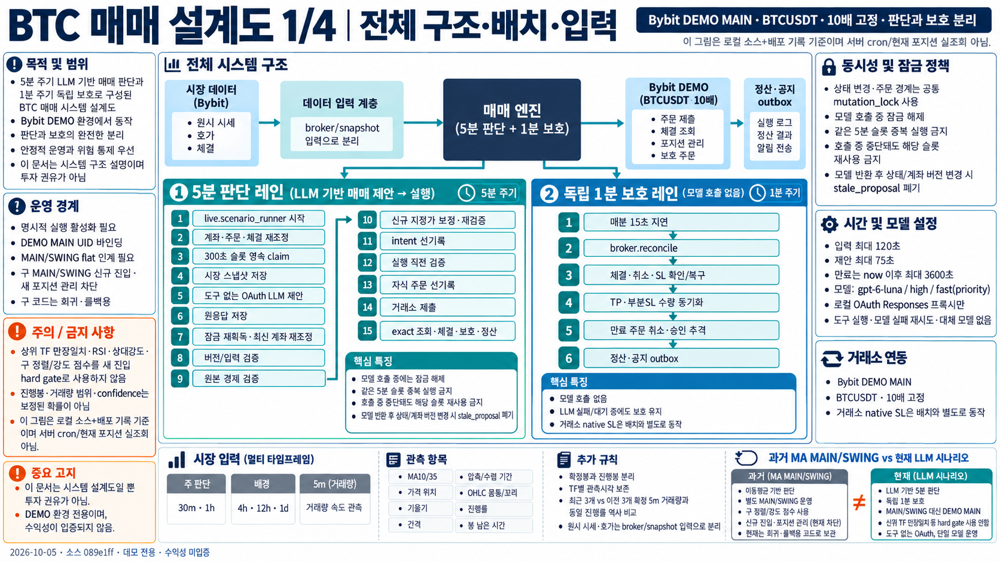
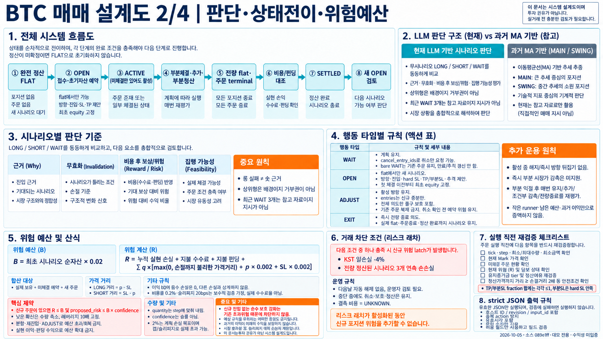
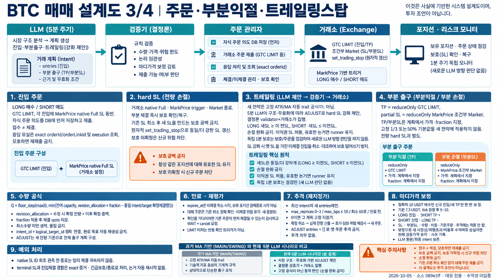
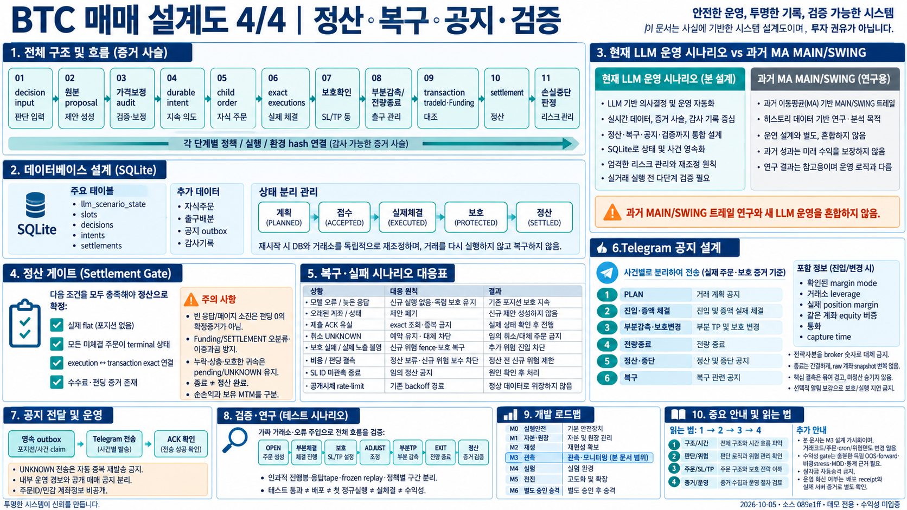

# BTC 매매 시스템 이미지 설계도

기준일: 2026-10-05 · 로컬 소스: `089e1ff93b4b1d0fba36459e8f8d26dedf457cb6`

최근 개편된 **Bybit DEMO MAIN LLM 시나리오**를 설명합니다. 과거 MA 기반 MAIN/SWING 전략과 구분합니다. 문서화 범위는 로드맵 M3이며, 주문·위험·배치·전략 변경이나 배포를 수행하지 않습니다. 서버 현재 상태를 직접 조회한 운영 감사는 아닙니다.

## 이미지 설계도

### 1. 전체 구조·배치·시장 입력

### 2. 판단·상태전이·위험예산

### 3. 주문·부분익절·트레일링스탑

### 4. 정산·복구·공지·검증

## 해석 시 주의사항

### 2026-10-06 승인: 유연한 단계별 TP 배분

범위는 M4 판단 정책과 M3 알림이다. 사용자는 최종 TP를 일괄 단축하는 대신 가까운 목표·중간 목표·
최종 목표에 추세별로 물량을 다르게 배분하도록 승인했다. 예시 비율은 고정 규칙이 아니며,
2~3개의 의미 있는 목표를 우선 비교하되 근거·수량이 부족하면 1개 또는 SL로 보호되는 무고정 TP 러너도 허용한다.
30분·1시간 주판단, 최소15분, 상위 프레임 장애물, 5분 재평가·1분 보호를 유지한다.
이번 변경은 비용 추정 산식 교체·모델 교체·재개 허가 재발급을 포함하지 않는다.

실제 연결은 snapshot/context → 조립 SYSTEM_PROMPT/response_contract → take_profits[{id,price,fraction}]
→ 가격·위험 검증 → _sync_exits의 기존 reduceOnly 주문 → 체결·잔량 증거 → 알림이다.
새 주문 형식이나 고정 비율 배분기를 만들지 않는다. OPEN은 초기 배치, 새 ADJUST는 잔량 기준이며
같은 intent의 이미 체결된 목표는 복원하지 않는다. 수량은 기존 규칙대로 내림하고 최소 미만은 건너뛴다.
따라서 표시 비율 합계가100%라도 실제 주문의 내림 잔량은 생길 수 있으며 기존 Full SL로 보호한다.
모델은 이 경우 목표를 줄이거나 합칠 수 있지만 거래소 최소 수량을 맞추려고 위험·수량을 늘리면 안 된다.

프레이밍 우선순위: 안전/허가 → 실제 잔량/체결 → 근거 있는 목표 구간 → 유연한 비중 → 비용·SL 비교.
강한 추세에서는 후단 물량을 더 남길 수 있고 약화 시 앞단 감축을 비교한다. 현재 추세가 좋아 보인다는
말만으로 목표를 반복 연장하지 않으며, 정상 눌림에도 기계적으로 앞당기지 않는다.
기존의 '부분익절이나 원거리 전량TP가 의무는 아님' 규칙과 일치하며 3단계·고정 등간격·고정 비율을 강제하지 않는다.
비용 후 양수 SL이 불가능하다는 사실은 구조적 위험 축소 자체의 금지가 아니다. 비용 전 본전 감축을
확정 수익으로 표현하지 않는다. 보유/약화/강한 추세 모두 LONG·SHORT 대칭으로 비교한다.

검증 계획을 실행 전 고정한다. 보존된 10월6일18:50 OPEN 후보,19:05 초기 보유,20:10 부분청산 후,
21:15 러너 입력을 같은 시각·같은 자료로 기존/후보 각2회 비교한다(총16회, 주문 없음).
강한 추세라는 합성 결론을 입력에 붙이거나 특정 ADJUST/TP 개수를 강제하지 않는다.
거절·WAIT·모델 오류도 모두 보존하며 같은 표본에 맞춰 재조정하지 않는다. 이미 본 거래이므로 독립 수익 검증이 아니다.
격리 거래소 테스트는3단계·양방향·소량·내림 잔량·부분체결·수정·재시작/재조회·초과청산 방지를 검증한다.
알림은 현재TP 또는 원래계획이라는 출처 구분을 유지하면서 최대3개 TP를 표시한다.
배포·정규루프·실제새TP체결·M5수익입증은 분리한다. 소진된0.5%허가와3연패 차단은 그대로 둔다.

### 2026-10-06 사용자 승인: 관측 후 단 한 번의 0.5% 데모 시험

3연패의 원인을 무조건 횡보장이라고 단정하지 않는다. 이번 변경은 M0/M3의 권한·기록과
M4의 제한적 재개 정책이다. 일반 위험 한도2%·10배·일 손실4%·계좌/정산/보호/시세 안전 검사를 유지한다.
사용자는 비용·미체결을 포함한 시작 실제 순자산0.5%의 한 시나리오만 승인했다.
현재 차단 비트를 지우거나 일 손익/완료 ID를 초기화하지 않는다.

ONLY three_losses인 정상 무포지션 상태에서 기존5분 루프가 OBSERVING으로 시세·모델 판단을 계속한다.
최초 관측은 기준점일 뿐 같은 실행에서 진입하지 못한다. 이 기준은 FIRST_POST_HALT_OBSERVATION이며
과거 손실을 일으킨 당시 시세라고 소급하지 않는다. 과거3개 정산은 ACCOUNTING_ONLY_NOT_CAUSE로
근거 해시와 함께 제공하며 결측은 UNKNOWN이다.
다음 입력의 실제 시장 수치 변화 경로와 LLM의 재개 근거·반대 근거·무효화 조건이 있어야 한다.
시간 경과·봉 진행률·확신도만으로는 재개하지 않는다. 수치 변화 자체도 수익 우위 증거는 아니다.

호스트는 새 주문 전에 입력·실제 모델 요청·원응답·검증 결과를 확인하고 허가를 소진한다.
소진·활성 시나리오·PENDING 의도를 같은 트랜잭션으로 저장한다. 허가는 방향·시나리오·원래 OPEN
배치·다음5분 이내 진입 마감·고정0.005 위험 비율에 묶인다. 최초 배치 안의 분할은 가능하지만
후속 추가 진입·추격·다른 방향/시나리오·자동 재시도는 금지한다. 무체결 취소·UNKNOWN·재시작도
사용한 시도를 되돌리지 않는다. 손실·수익·무체결 모두 종료 정산 후 DONE_REVIEW_REQUIRED이며
자동2% 복귀하지 않는다. 수익 시험도 과거 연패 수를 지우지 않는다.

core 검증, 실제 주문 직전 검사, 독립 보호/예약 취소가 같은 허가를 확인한다. 명목 순자산을
줄여 예산을 꾸미지 않고 실제 시작 순자산에0.5%를 적용한다. 보유·미체결·기록된 비용을 모두 포함하고
수익으로 예산을 보충하지 않는다. 일 손실·비정상 계좌·미확정 실행·기록 실패는 새 허가를 막는다.
허가 만료는 미체결 진입 취소 기준이며, 보유 SL/TP/EXIT를 중단하지 않는다.
보유 중 응답 만료는 현재 시각 기준으로 새로 주되 원래 진입 허가를 연장하지 않는다.

필수 기록은 llm_scenario_recovery_events와 기존 decisions/intents/children/settlements에 연결한다.
INPUT, MODEL_REQUEST, MODEL_RAW, MODEL_ERROR, RECHECK, DECISION, OUTCOME, PERMIT_CONSUMED,
EXCHANGE_REQUEST/RESPONSE/ERROR, SETTLEMENT에 실행 슬롯·입력·시나리오·허가·호출 ID를 남긴다.
실제 조립 프롬프트/스키마/모델 설정/원응답/정책·실행 해시를 저장한다. 요청/원응답 기록 실패면
새 시험을 허용하지 않는다. 보호·취소·청산은 로그 장애에 막히지 않고 AUDIT_GAP을 남긴다.
로그 크기 상한·디스크 장애에서는 완전 보존을 보장할 수 없으므로 미기록을 성공으로 표시하지 않는다.
모델 응답과 주문 접수는 체결 증거가 아니며 정산은 정확한 체결 ID로 확인한다.
정책·실행 지문은 파일별 AST 해시를 다시 묶어 계산한다(OBSERVED_DISK_AST_PER_FILE_SHA256).
이전 해시 방식과 동일 버전으로 묶지 않으며, 디스크 관측과 실제 로드 확인 상태를 구분한다.

재현 테스트는 첫 관측·변화 없음·가짜 경로·혼합 차단·0.5% 초과·동시 호출·재시작·무체결·UNKNOWN·
허가 만료·보호 유지·로그 실패·수익 후 재시도 금지·롱/숏 대칭을 포함한다.
이것은 한 번의 데모 관측 허용이지 수익성 승격이 아니다. 기존 고정 중단/시간 재개/적응 재개
사이의 장기간 비용 후 성과 비교는 별도 미완료이며 이번 기능 테스트로 대체하지 않는다.
주문 없는 모델 검증은 10월6일03:45/03:50 보존 시세에 가상 무포지션·연패 상태를 결합해
FIRST/UNCHANGED/CHANGED/HARD_BLOCKED 각2회 총8회로 사전 고정한다. UNCHANGED는 현재 수치를
이전 기준점으로 반복한 합성 반례다. HARD_BLOCKED는 실제 운영에서는 모델 호출 이전 차단되는
조건을 별도 시험한다. 허가 소비는 격리 임시 DB에서만 수행하며 거래소 주문은 연결하지 않는다.
롤백은 신규 관측/허가 발급을 먼저 보류하고, 이미 소진된 허가의 보유·예약을 해석하는 현재 버전에서
보호·취소·정산을 마친 뒤 수행한다. 기존 SL을 제거하거나 기록을 삭제하지 않는다.

### 2026-10-06 비용 후 수익 보호·조건부 예약 진입

사용자는 10배 표시 수익률 +1% 고정이 아니라 **기록된 비용과 예상 청산 비용을 반영한
플러스 SL**을 원하며, 다음 판단 사이의 조건부 예약 진입도 승인했다. 기준선324dedcb,
M0 실행·M4 정책 변경이다. 3연패 중단·원래2%·10배·데모 전용·최소15분봉은 유지한다.

수익 보호 참조는 기존 확정 회계와 잔여 물량으로 전체 시나리오 손익이 양수가 되는 첫 호가를
Decimal로 계산한다. 롱은 위쪽, 숏은 아래쪽으로 보수적으로 반올림하며 기존의 더 강한 SL은
완화하지 않는다. 향후 비용은 기존 보수적 비용률0.002와 미끄러짐20bps의 허용액이지 실제
수수료 등급이 아니다. 따라서 실제 비용만으로 계산한 본전보다 더 큰 유리한 움직임이 필요할 수 있다.
미래 펀딩·갭·체결가를 보장하지 않는다. 가격상 가능과 구조상 노이즈 여유는 다르므로 첫 양수 호가를
기계적으로 강제하지 않는다. LLM은 가능한 수익 보호를 우선 검토하되 보류하면 구조적 이유를 설명한다.

예약은 entries.trigger_price가 있는 네이티브 조건부 지정가다. MarkPrice 상승 돌파는 롱,
하락 이탈은 숏이며 entry.price가 최악 체결가 한도다. 이미 조건을 지난 입력은 즉시 주문으로
변환하지 않는다. 보통 지정가는 trigger_price=null/누락으로 기존 동작을 유지한다.
조건부 체결 한도는 마디가격 보정·자동 추격으로 변경하지 않는다.
계좌는 하나의 활성 시나리오·한 방향만 허용하며, 접수 전부터 예약 전체 수량의 위험을 포함한다.
취소 접수만으로 위험을 빼지 않고 정확한 주문 상태·체결을 대조한다. 취소 중 체결은 보호하고,
무포지션·모든 주문 terminal·정산 확인 전 반대 방향 신규 진입은 금지한다.

마감은 **원본 입력의 다음 5분 경계**이며 기존 1분 점검이 취소를 요청·확인한다. 거래소 GTC의
원자적 시각 만료가 아니므로 통신 장애·취소 경합 중 체결될 수 있다. WAIT나 후속 ADJUST가
기존 예약의 원래 마감을 연장하지 않는다. SL 무효화 가격을 먼저 관측한 예약도 취소한다.
네이티브 전량 Market SL은 진입에 첨부하고 TP는 체결 확인 후 동기화한다. 둘을 원자적으로
첨부했다거나 무위험이라고 설명하지 않는다. 가격 한도 밖에서는 조건 발동 후에도 미체결일 수 있다.

실제 연결은 snapshot/context → strict wire → core/가격 검증 → 영속 intent → 조건부 요청 →
정확한 주문/체결 확인 → 기존 보호/TP/정산이다. 미체결 입력에는 trigger·상태·원래 마감을
전달한다. private 계획 알림은 조건부·미체결·취소 확인 전 체결 가능을 명시하며 구독자에게
예약을 체결로 공지하지 않는다. source/receipt의 버전은 기존 provenance에 포함한다.

검증 계획은 롱/숏·트리거 전 무체결·Last만 접촉·Mark 접촉·가격갭 한도·만료 연장 금지·
취소 ACK 후 체결·조회 실패·재시작·부분체결·반대 방향 거부·SL 여유 주문 수·기존 지정가
호환 및 비용/호가/평단/부분실현/불가능SL의 반례를 포함한다. 실행 손익 개선은 새 관측 기간에서
평가하며 기능 테스트를 수익성 증거로 사용하지 않는다. 거래소 실제 조건부 주문은 중단 상태를
해제해 시험하지 않고 첫 자연 예약/체결을 별도 미완료로 남긴다.

주문 없는 모델 비교는 공개 시세 snapshot 하나에 합성 계좌4조건(무포지션·수익 중 롱·수익 중 숏·
신규위험차단 무포지션)을 기존/후보 프롬프트 각1회씩 총8회로 사전 고정한다.
보유 수익 사례의 가상 평단은 관측 가격의99%/101%, 수량0.02BTC이며 확인된 실제 거래가 아니다.
두 프롬프트에 새 계약·보강 입력을 동일하게 전달한다. 오류와 지연을 보존하며 주문·성과를 추정하지 않는다.

공식 확인: [주문 생성](https://bybit-exchange.github.io/docs/v5/order/create-order),
[주문 조회](https://bybit-exchange.github.io/docs/v5/order/open-order),
[비동기 취소](https://bybit-exchange.github.io/docs/v5/order/cancel-order).
이상 발생 시 검증된 되돌림 PR로 신규 예약 제안 기능을 보류하며, 이미 남은 예약은 새 기능을
모르는 구버전으로 덮지 않고 현재 버전에서 취소·체결·보호를 먼저 대조한다. 기존 SL을 제거하지 않는다.

### 2026-10-06 재평가 기억·잔여 손익·중단 상태 점검 보완

사용자 승인으로 M0/M3의 의도적 중단 오경보와 M4 보유 판단 입력을 분리해 보완한다.
기준선 a4082509이며 모델·OAuth 경로·10배·원래 시나리오 2%·3연패 중단을 유지한다.
중단 해제나 실제 주문을 시험 목적으로 실행하지 않는다.

- 오경보: 최근 정규 판단이 확인된 무포지션 중단이며 독립 보호 점검도 무포지션·무주문을
  확인했을 때만 시세 수집 생략을 정상으로 구분한다. 실제 시세 시각을 갱신한 척하지 않으며,
  오래된/잘못된 실행 기록·보유 포지션·미확정 주문·실행 오류는 경보를 유지한다.
- 재평가 기억: 최소 15분봉 판단은 유지하고, 모델이 명시한 수치 조건은 별도 메타데이터로
  저장한다. 조건은 관측 MarkPrice 기준으로만 확인하며 과거 설명에서 가격을 추출하지 않는다.
  생성 이전 관측이나 미래/오래된 시세로 충족을 판정하지 않는다. 관측 사이에 잠깐 통과했는지는
  알 수 없다. 조건 충족은 자동 청산 명령이 아니다.
- 조건을 한 번 충족하면 되돌림 뒤에도 기록을 보존한다. 유지·교체에는 호스트가 제시한 조건 ID와
  이유가 필요하며, 빈 응답·잘못된 메타데이터·거절/오래된 제안으로 기존 조건을 지우지 않는다.
  잘못된 부가 기억 정보 때문에 정상 EXIT·보호 강화가 막혀서는 안 된다. 주문 검증기는 기존대로 유지한다.
- 부분익절 후 손익: 확인된 실현 gross·수수료·펀딩 net에 잔여 보유의 현재가/현재 SL 가정 손익을
  더해 보여준다. 향후 비용은 기존 보수적 비용률·미끄러짐 가정의 허용액이지 실제 수수료 등급이 아니며
  미래 펀딩은 미포함이다. 새 제안 SL에 대한 계산으로 오인하지 않는다. 결측·미확정·미체결 진입이
  있으면 전체 결과를 확정하지 않는다. 수익으로 원래 위험 예산을 늘리지 않는다.

보유 판단은 현재 시나리오 전체 결과와 정상 눌림/추세 재개 반례를 함께 비교한다.
무조건 본전 SL·익절 강제·상위봉 일치 하드 게이트는 넣지 않는다.
검증은 실제 모듈의 재시작·WAIT 저장·충족 후 되돌림·오래된 응답·메타데이터 오류와 정상 EXIT,
롱/숏 대칭·정산 결측·누적 손익 부호·미확정 주문·거래 중단 상태를 포함한다.
같은 입력의 모델 제안 비교는 수익성 또는 독립 holdout 증거가 아니다. 모델은 변경하지 않아
입력 구조 보완 효과와 모델 교체 효과를 섞지 않는다. 새 정책은 별도 관측 구간으로 기록한다.
현재 3연패 중단 중이면 배포 뒤 자연 중단/보호 점검만 확인할 수 있고 새 매매 판단은 미관측으로 남긴다.
안전 회귀 또는 기억 손상으로 실행이 막히면 부가 기억 기능을 검증된 되돌림으로 복귀하며 보호·정산은 유지한다.

사전 고정 모델 비교: 10월6일01:30/02:00/03:35 KST 보존 snapshot/context와 마지막 상태의
신규위험차단 합성 반례를 기존/후보 프롬프트 각1회, 총8회 비교한다. 두 프롬프트에 새 계약과 같은
보강 입력을 전달하므로 전체 시스템 변경의 수익 효과를 분리 추정하는 실험은 아니다.
85,389 이상 조건은 **시험용 합성 기억**이며 당시 모델이 구조화 출력했다고 소급 기록하지 않는다.
경제 정보는 당시 같은 account_version에 연결되고 요청 이전에 저장된 회계 관측만 사용하며 없으면 미확인이다.
원응답·거절·지연을 모두 보존하고 원하는 매매 결과가 나오도록 같은 사례를 반복 튜닝하지 않는다.

### 2026-10-06 TP 경로 검토 보완 (M4)

사용자 승인에 따라 30분·1시간 중심 방향 판단과 별개로, OPEN·매 보유 점검·ADJUST에서
4시간·12시간·일봉·주봉 MA10/35와 가격 구조 중 목표까지 지나야 할 장애물을 검토한다.
"상위 봉은 진입 거부권이 없다"는 것은 "상위 봉의 출구 장애물을 무시한다"는 의미가 아니다.
MA는 잠재 지지·저항이며 보장된 반등선이 아니다. 형성 중 값과 확정 값을 구분하고 미세한 MA 이동만으로
주문을 반복 변경하지 않는다. 지지·저항 앞 부분 목표와 보호된 잔여 물량, 근거 있는 돌파 후 먼 목표를 비교한다.
중요 장애물 너머 전량 TP를 유지한다면 통과 근거와 실패 시 대응을 짧게 설명한다.
숏의 가까운 익절은 더 높은 가격, 목표 연장은 더 낮은 가격이며 롱은 반대다.

최소15분봉·5분판단·1분보호·원래2%·10배·데모와 실행/응답 스키마는 변경하지 않는다.
즉시 부분 시장가 청산을 새로 지원하지 않으며 ADJUST는 기존 전체 보호·잔여 quota 규칙을 따른다.
이번 작업은 프롬프트 정책 변경이지 손절 결과 한 건으로 수익 개선을 입증하는 작업이 아니다.
기준선 bb02d615에서 01:00/01:05/01:10 KST 보존 입력 및 마지막 입력의 신규위험차단 합성 사례를
기존/후보 각각1회씩 주문 없이 비교하도록 사전 고정했다. 같은 입력의 제안 검증이며 과거 체결 재구성이 아니다.
롱 대칭·돌파 지속·결측·최소수량·위험차단·기존 체결 quota·손절확대금지를 함께 검증한다.
검증 head의 CI와 격리 테스트 후에만 배포하며 첫 자연 판단을 별도로 확인한다. M5 수익성은 미입증이다.
운영 주문을 수동 수정하지 않는다. 위험 우회·불필요한 반복 교체가 발견되면 검증된 되돌림 PR로
정책을 복귀하며 기존 보호를 삭제하지 않는다. 기존 주간 검토에서 새 정책 구간을 따로 관측한다.

- 2%는 최초 시나리오 순자산 기준의 비용 포함 계획 손실 예산이며, 실제 손실의 절대 상한이 아닙니다.
- 새 트레일링은 LLM의 ADJUST와 결정론 검증을 통한 단조 손절 강화입니다. 과거 고정 MA/ATR 트레일 공식이나 고정 부분익절 비중을 새 전략 규칙으로 읽지 않습니다.
- 5분 판단과 독립 1분 보호, 거래소 native SL은 서로 다른 계층입니다. 1분 보호는 추가 LLM 판단이 아닙니다.
- 로컬 구현, 배포 기록, 실제 전진 체결, 수익성 입증을 구분합니다. 이 이미지 제작으로 로드맵 완료 상태를 변경하지 않습니다.
- 이미지의 작은 글자는 원본 파일에서 확대해 읽으십시오. 코드·검증 계약이 이미지보다 우선합니다.

## 확인한 근거

- `prism-btc/live/scenario_llm.py`: 판단 프롬프트·모델·75초 호출 제한·strict 출력.
- `prism-btc/engine/scenario_snapshot.py`: 진행봉·MA·다중 시간봉 관측.
- `prism-btc/core/llm_scenario.py`: 위험 산식·중단·상태별 행동·추격 한도.
- `prism-btc/live/scenario_runtime.py`: 5분 슬롯·잠금·재조정·영속 의도.
- `prism-btc/live/scenario_runner.py`: 독립 보호 진입점·활성화 경계.
- `prism-btc/live/scenario_execution.py`: 주문·native SL·부분 출구 quota·추격·담보 검증.
- `prism-btc/live/scenario_broker.py`: 실제 계좌·체결·보호·회계 통합.
- 10/3 전환 승인, 10/5 양방향·미체결 재평가, 신규 지정가 마디 보정 기록: 2026-10-05 문서 정리로 삭제됐으며 git 이력에서 조회합니다.
- `docs/BTC_POSITION_MESSAGE_CONTRACT_20260915_ko.md`: 공지 계약.
- `docs/BTC_ROADMAP_ko.md`: 단계·증거·승격 제한.

## 제작 방식

내장 image_gen 도구로 생성합니다. 도구에 모델 선택 인자가 없어 GPT Image 2.5 사용을 확약하지 않습니다. 공식 문서는 GPT Image 2.5 Sunburst/Flare를 설명합니다: https://developers.openai.com/api/docs/guides/image-generation

전체 생성 프롬프트는 이미지 폴더의 `generation-prompts.json`, 2장 보완 프롬프트는 `revision-prompt.txt`에 보존합니다. 원본은 각 1672×941 PNG입니다. 4장 모두 직접 시각 검수했으며 2장의 확신도 위험 제한과 순수 보호 강화 예외를 보완했습니다. 작은 글자·개념 요약은 코드의 모든 분기나 장애 사례를 대체하지 않습니다. 매매 코드와 운영 데이터는 변경하지 않습니다.
