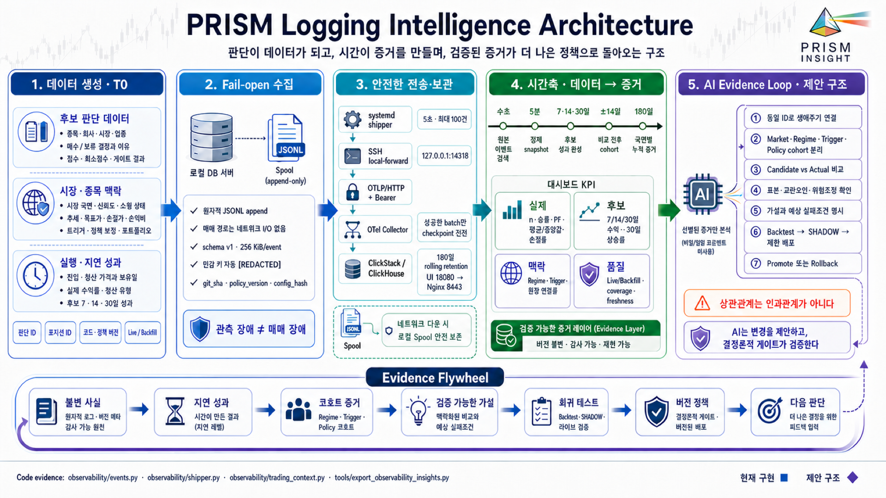
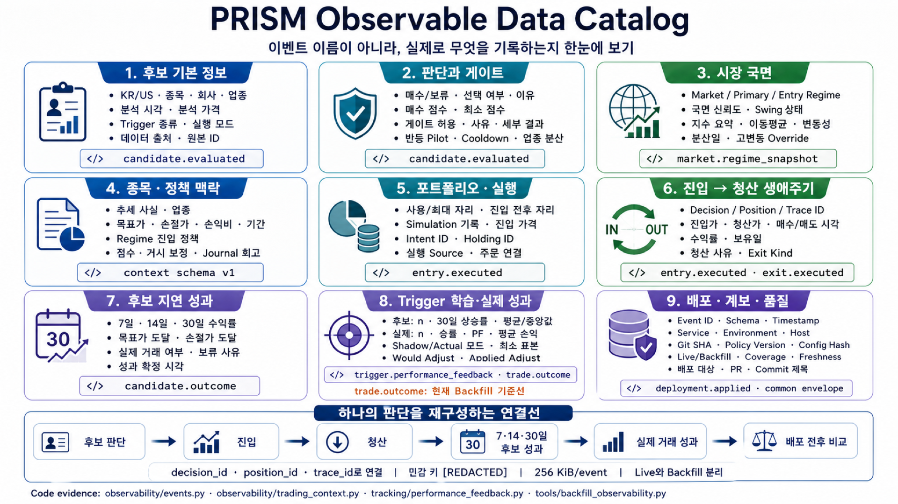

# PRISM Logging Intelligence Architecture

> 판단이 데이터가 되고, 시간이 증거를 만들며, 검증된 증거가 더 나은 정책으로 돌아오는 구조

이 문서는 PRISM-INSIGHT의 매매·분석 과정에서 데이터가 생성되는 순간부터
ClickStack/ClickHouse에 적재되고 대시보드 지표로 정제되는 현재 구조를 설명합니다.
또한 이 데이터가 충분히 쌓였을 때 AI가 무엇을 근거로 추론해야 하며, 어떤 검증
절차를 거쳐 시스템 개선안으로 연결해야 하는지 목표 구조를 제안합니다.

기준일은 **2026-08-28**입니다. 코드에 이미 존재하는 경로와 향후 제안 구조를
의도적으로 분리했습니다.



## 그림 읽는 법

- **파랑·청록 영역**은 현재 구현된 데이터 생성, 로컬 기록, 전송, 저장 경로입니다.
- **초록 영역**은 현재 구현된 정제 지표와 시간이 지나며 완성되는 성과 데이터입니다.
- **보라 영역**의 `AI Evidence Loop`는 목표 구조입니다. 현재 AI가 ClickHouse를
  직접 읽어 정책을 자동 변경한다는 뜻이 아닙니다.
- 아래쪽 `Evidence Flywheel`은 현재의 불변 기록을 출발점으로 삼되, 가설·검증·승격
  절차는 앞으로 갖춰야 할 운영 계약까지 포함합니다.

## 핵심 원칙

1. **관측 장애와 매매 장애를 분리합니다.** 매매 프로세스는 로컬 JSONL에만
   append하며, 네트워크·ClickStack·대시보드 상태를 매수·매도 판단에서 조회하지
   않습니다.
2. **판단 당시의 사실과 나중에 관측된 결과를 분리합니다.** 시장 국면, 종목 추세,
   게이트, 점수, 포트폴리오 상태는 판단 시점에 고정하고, 7·14·30일 성과와 실제
   청산 결과는 나중에 별도 이벤트로 연결합니다.
3. **결과뿐 아니라 계보를 남깁니다.** `decision_id`, `position_id`, `trace_id`,
   `git_sha`, `policy_version`, `config_hash`를 함께 기록해 어떤 코드와 정책이 어떤
   판단과 결과를 만들었는지 추적합니다.
4. **AI는 증거를 요약하고 변경을 제안합니다.** 라이브 정책 변경은 회귀 테스트,
   백테스트, SHADOW, 제한 배포와 롤백 조건을 통과해야 합니다.

---

## 1. 현재 데이터 생애주기

```text
KR·US 분석/매매/성과 추적
        │
        ├─ 판단·시장·성과 이벤트 생성
        ▼
logs/prism_events.jsonl        ← 매매 경로의 마지막 관측 경계
        │                         네트워크 I/O 없음, 실패 시 None
        ▼
systemd observability shipper  ← 5초 간격, 최대 100건
        │
        ▼
SSH local-forward :14318
        │
        ▼
OTLP/HTTP + token → OTel Collector → ClickStack / ClickHouse
                                      │
                         localhost HTTP :18123
                                      ▼
                         180일 이벤트 조회·정제
                                      │
                         5분 주기 snapshot 생성
                                      ▼
                     observability_insights.json
                                      │
                                      ▼
                              Insights 대시보드
```

### 1.1 매매 데이터 평면과 관측 데이터 평면

**매매 데이터 평면**은 분석, 게이트, 주문, 포지션, 청산과 SQLite transaction을
담당합니다. **관측 데이터 평면**은 이미 확정된 사실을 복사해 검색·비교할 수 있게
만듭니다. 관측 평면은 매매 평면의 의존성이 아닙니다.

- `candidate.evaluated`, `entry.executed`, `exit.executed`는 관련 SQLite commit이
  성공한 다음 fail-open 방식으로 기록됩니다.
- 네트워크 전송은 독립 systemd shipper가 수행합니다.
- ClickStack을 읽는 코드는 매수, 매도, hard-stop, fill 경로에 존재하지 않습니다.
- 대시보드 snapshot이 없거나 오래돼도 기존 포트폴리오 대시보드는 계속 동작합니다.

---

## 2. 어떤 데이터가 쌓이는가

아래 카탈로그는 내부 이벤트명을 모르더라도 실제 기록 내용을 이해할 수 있도록
데이터를 아홉 묶음으로 펼친 것입니다. 이벤트명은 각 카드 아래의 작은 코드 태그로만
남겨, 문서 본문과 실제 구현을 연결합니다.



### 2.1 이벤트 원장

| 이벤트 | 생성 시점 | 핵심 데이터 | 현재 경로 |
|---|---|---|---|
| `candidate.evaluated` | 후보 판단과 watchlist 저장 후 | 결정, 점수, 게이트 결과, 시장 국면, 추세 사실, 포트폴리오 자리 | Live |
| `entry.executed` | 진입 기록 transaction commit 후 | 진입가, 종목·시장 맥락, 주문·시뮬레이터 기록, 자리 변화 | Live |
| `exit.executed` | 청산 기록 transaction commit 후 | 청산가, 수익률, 보유일, 매도 사유, `exit_kind`, 진입·청산 국면 | Live |
| `market.regime_snapshot` | KR·US 시장 국면 계산 때마다 | regime, confidence, primary/effective regime, swing state, 지수 요약 | Live + Backfill |
| `trigger.performance_feedback` | 매매일지 기반 trigger 보정 계산 시 | mode, 표본, 성과, 적용 조정값 | Live |
| `candidate.outcome` | 관찰 후보의 30일 추적 완료 시 | 7·14·30일 수익률, 목표가·손절가 도달, 거래 여부 | Live + Backfill |
| `trade.outcome` | 검증된 과거 청산 row를 기준선으로 가져올 때 | 매수·매도 가격/시각, 수익률, 보유일, trigger, exit kind | Backfill |
| `deployment.applied` | 실제 서버 pull/merge 이력 또는 운영 이벤트 | git SHA, 대상 서버, PR, commit subject, 검증된 배포 여부 | Backfill 우선, Live 수용 |

`candidate.evaluated`는 실제로 산 종목만 남기지 않습니다. 사지 않은 후보도 판단과
30일 결과를 남기므로, **선택된 거래의 성과**와 **놓친 후보의 기회비용**을 서로
다른 지표로 비교할 수 있습니다.

### 2.2 공통 이벤트 envelope

모든 이벤트는 `observability/events.py`의 schema version 1을 사용합니다.

| 범주 | 필드 | 역할 |
|---|---|---|
| 정체성 | `event_id`, `event_type`, `timestamp`, `time_unix_nano` | 중복 제거와 시간 정렬 |
| 생애주기 | `trace_id`, `span_id`, `parent_event_id`, `decision_id`, `position_id` | 후보 → 진입 → 청산 연결 |
| 실행 환경 | `service`, `environment`, `host`, `market`, `ticker` | 실행 위치와 시장·종목 분리 |
| 코드 계보 | `git_sha`, `policy_version`, `config_hash` | 결과를 만든 코드·정책·설정 식별 |
| 내용 | `attributes` | 이벤트별 구조화 사실 |

`event_id`는 같은 사실의 중복 적재를 제거하고, `decision_id`는 후보와 진입을,
`position_id`는 진입과 청산을 연결합니다. `trace_id`는 이 생애주기를 하나의 검색
단위로 묶습니다.

### 2.3 매매 context schema

`candidate.evaluated`, `entry.executed`, `exit.executed`는 다음 context를 공유합니다.

- `market_context`: 이벤트 시점의 시장 국면과 신뢰도
- `entry_market_context`: 진입 당시 고정된 시장 snapshot
- `security_context`: 추세 사실, 업종, 목표가, 손절가, 손익비, 투자 기간
- `policy_context`: regime entry policy, score/macro adjustment, journal reflection
- `decision_context`: 결정, 점수, gate 허용 여부와 이유, exit kind, 수익률
- `portfolio_context`: 사용 중인 자리와 최대 자리, 진입 전후 변화
- `execution_context`: simulator 기록, legacy holding ID, intent ID 등 실행 근거

이 구조 덕분에 청산 시점의 시장과 진입 시점의 시장을 동시에 비교할 수 있습니다.
긴 보고서와 원본 프롬프트는 ClickHouse로 복사하지 않습니다. 구조화된 판단 사실과
원본을 재구성할 수 있는 식별자만 남깁니다.

### 2.4 개인정보·비밀정보 경계

- key 이름에 account, token, password, secret, cookie, authorization 등이 포함되면
  값은 `[REDACTED]`로 교체됩니다.
- 환경 전체를 복사하지 않고 관측이 승인된 설정 key만 `config`에 담습니다.
- 중첩 데이터는 깊이 8에서 잘리고 이벤트 한 건은 256 KiB로 제한됩니다.
- spool과 checkpoint는 mode `0600`으로 운용합니다.

---

## 3. Fail-open 수집과 전송

### 3.1 로컬 append

`emit_event()`는 `O_APPEND | O_CREAT | O_WRONLY`로 JSON 한 줄을 기록합니다.
어떤 예외가 발생해도 호출자에게 `None`을 반환하며 매매 판단을 실패시키지 않습니다.
동기 재시도나 네트워크 호출도 하지 않습니다.

### 3.2 checkpoint 기반 shipper

`observability/shipper.py`는 spool의 inode와 byte offset을 checkpoint로 저장합니다.

- 기본 간격: 5초
- 기본 batch: 최대 100건
- 전송 timeout: 5초
- checkpoint: batch 전송이 성공한 뒤에만 원자적으로 교체
- 파일이 교체되거나 작아지면 inode·size를 기준으로 offset 재설정
- 1 MiB를 넘거나 JSON이 깨진 한 줄은 건너뛰고 뒤 이벤트를 계속 처리
- 네트워크 장애 시 checkpoint가 전진하지 않으므로 다음 주기에 다시 시도

spool은 append-only 원장입니다. 전송 성공이 원본 줄 삭제를 뜻하지 않습니다.
따라서 장기 운영에서는 별도의 안전한 rotation·용량 경보가 필요합니다.

### 3.3 OTLP 변환

shipper는 원본 sanitized event 전체를 OTLP log body에 JSON으로 담고, 자주 검색하는
필드를 log attribute로 승격합니다.

- `event.name`, `event.id`
- `prism.market`, `prism.ticker`
- `prism.git_sha`, `prism.policy_version`, `prism.config_hash`
- `prism.decision_id`, `prism.position_id`
- `prism.trigger_type`, `prism.regime`, `prism.swing_state`
- `prism.feedback_mode`, `prism.applied_adjust`

이 방식은 원본 재현성과 ClickHouse filter 성능을 함께 확보합니다.

---

## 4. 배포 인프라와 보안 경계

| 위치 | 구성요소 | 역할 |
|---|---|---|
| `db-server` | PRISM pipeline | 매매·분석 수행, 이벤트 append |
| `db-server` | JSONL spool + checkpoint | 네트워크와 분리된 로컬 완충 원장 |
| `db-server` | systemd shipper | batch 읽기, OTLP 변환, 성공 checkpoint |
| `db-server` | SSH local-forward | `127.0.0.1:14318`을 backend의 collector로 연결 |
| `prism-backend` | 독립 OTel Collector | token 인증 후 ClickHouse로 전달 |
| `prism-backend` | ClickStack all-in-one | ClickHouse 저장, ClickStack UI와 내부 metadata |
| `prism-backend` | Nginx `8443` | Basic Auth를 적용한 UI reverse proxy |
| `app-server` | 정제 snapshot | credential이 없는 `observability_insights.json` 제공 |

외부에 직접 바인딩하지 않는 포트는 다음과 같습니다.

- `127.0.0.1:14318` → OTel Collector `4318`
- `127.0.0.1:18123` → ClickHouse HTTP `8123`
- `127.0.0.1:18080` → ClickStack UI `8080`
- Nginx `8443`만 인증을 거쳐 UI를 proxy

운영 token과 host는 Git 밖의 `/etc/prism-observability/*.env`에서 주입합니다.
ClickHouse 전용 사용자는 observability database로 제한하며 plaintext password 대신
SHA-256 hash를 mounted XML에 기록합니다.

컨테이너와 서비스도 매매 자원을 침범하지 않도록 제한합니다.

- ClickStack: `0.85 CPU`, `1800 MiB`, PID 2048
- OTel Collector: `0.15 CPU`, `256 MiB`, PID 256
- shipper systemd: `CPUQuota=20%`, `MemoryMax=96M`, `Nice=10`
- snapshot exporter: `CPUQuota=30%`, `MemoryMax=128M`, `Nice=10`

---

## 5. 시간이 데이터를 증거로 바꾸는 과정

### 수초: 원본 이벤트 검색

운영자는 ClickStack에서 event name, market, ticker, regime, decision/position ID,
git SHA를 기준으로 한 판단의 생애주기를 검색할 수 있습니다. 이 단계의 목적은
장애 조사와 사실 확인입니다.

### 5분: credential-free snapshot

systemd timer가 5분마다 ClickHouse의 `otel_logs`를 로컬 HTTP endpoint로 조회합니다.
조회 대상은 승인된 여덟 event type뿐이며, 이벤트 body를 다시 JSON으로 읽어
`observability_insights.json`을 만듭니다.

publisher는 전용 SSH identity로 app-server에 `.tmp` 파일을 복사한 뒤 `install`로
원자적으로 교체합니다. dashboard fetch가 실패하면 관측 패널만 숨깁니다.

### 7·14·30일: 후보의 지연 성과

performance tracker가 30일 추적을 완료하면 `candidate.outcome`을 기록합니다.
7·14·30일 수익률, 목표가/손절가 도달 여부가 판단 당시의 `decision_id`와 연결됩니다.
결과가 아직 생기지 않은 후보를 성급하게 성공·실패로 분류하지 않는 **지연 label**
구조입니다.

### 배포 전후 14일: 관측 연관성

각 `deployment.applied` 시점을 기준으로 매수일이 이전 14일과 이후 14일에 속하는
실제 거래 cohort를 나눕니다. 평균 수익률 변화와 표본 수를 보여주지만, 이는
**인과관계의 증명이 아니라 관측된 연관성**입니다. 시장 국면, trigger 구성,
보유 기간, 동시 배포가 다르면 결과가 왜곡될 수 있습니다.

### 180일: rolling evidence layer

현재 운영 목표는 180일 rolling retention입니다. 이 기간 동안 시장·trigger·정책
버전별 cohort가 쌓입니다. 180일을 넘는 장기 학습이 필요하면 원본 보존 기간을
무작정 늘리기보다, 출처와 계산식을 가진 일·주 단위 aggregate를 별도 보존하는
편이 안전합니다.

---

## 6. 현재 대시보드가 보여주는 것

### 실제 거래

- 표본 수
- 승률
- 평균·중앙값 수익률
- 평균 이익·평균 손실
- profit factor
- stop/hard/risk/손절 계열 청산 비율
- 수익률 표본이 5건 이상인지 여부

### 거래하지 않은 관찰 후보

- 7·14·30일 평균·중앙값 수익률
- 30일 양수 수익률 비율
- 30일 결과 표본이 5건 이상인지 여부

### 판단 context 원장

- candidate / entry / exit 이벤트 수
- `decision_id`, `position_id` 보유 비율
- 같은 `position_id`에 entry와 exit가 모두 존재하는 완결 chain 수
- 최신 context 시각

### 시장과 데이터 품질

- 최신 regime과 confidence
- regime 분포
- live와 backfill event 수
- coverage 시작 시각과 마지막 event 시각
- snapshot freshness

### 반드시 알아야 할 현재 한계

현재 exporter의 **실제 거래 KPI는 `trade.outcome`만 집계**합니다. 저장소 안에서
`trade.outcome`은 검증된 SQLite 청산 row를 가져오는 backfill 경로로 생성됩니다.
라이브 `exit.executed`에는 수익률과 청산 정보가 있지만 actual KPI에는 직접 포함되지
않습니다. 따라서 다음 우선순위는 청산 transaction commit 뒤 동일한 `position_id`로
live `trade.outcome`을 발행하거나, 두 이벤트를 중복 없이 결합하는 명확한 계약을
추가하는 것입니다.

---

## 7. AI가 합리적으로 추론하기 위한 목표 구조

AI에게 ClickHouse raw access와 “좋아 보이는 패턴을 찾아 정책을 바꾸라”는 지시만
주면 선택 편향, 미래 정보 누수, 작은 표본 과적합이 발생합니다. AI 입력은 다음처럼
출처가 고정된 **Evidence Packet**이어야 합니다.

```json
{
  "question": "GapAndHold의 sideways 진입 점수를 조정할 근거가 있는가?",
  "cohort": {
    "market": "KR",
    "regime": "sideways",
    "trigger_type": "GapAndHold",
    "policy_version": "<version>",
    "window": "<start/end>"
  },
  "sample": {
    "actual_n": 0,
    "candidate_n": 0,
    "coverage": "<coverage>",
    "freshness": "<timestamp>"
  },
  "metrics": {
    "actual": "win rate, PF, average, median, stop rate",
    "candidate": "7/14/30d return and 30d positive rate"
  },
  "provenance": {
    "event_ids": [],
    "git_sha": "<sha>",
    "policy_version": "<version>",
    "config_hash": "<hash>"
  },
  "confounders": [],
  "hypothesis": "<one change only>",
  "failure_condition": "<measurable rollback rule>"
}
```

### 7.1 추론 순서

1. **데이터 품질을 먼저 검사합니다.** freshness, live/backfill 비율, coverage,
   decision/position link 완결률을 확인합니다.
2. **판단 시점의 feature와 결과 시점의 label을 분리합니다.** 30일 뒤 알게 된 값을
   진입 당시 feature처럼 사용하지 않습니다.
3. **cohort를 먼저 고정합니다.** KR/US, market regime, trigger, policy version,
   배포 시점, 거래/비거래를 섞지 않습니다.
4. **Candidate와 Actual을 함께 봅니다.** 실제 거래 수익만 보면 선택된 표본만 남고,
   후보 성과만 보면 실행 비용·포트폴리오 제약을 놓칩니다.
5. **표본과 불확실성을 표시합니다.** 현재 UI의 최소 기준은 `n >= 5`지만,
   정책 자동 승격 기준으로는 부족할 수 있습니다. 신뢰구간, bootstrap, 기간 분할,
   극단값 민감도를 함께 계산해야 합니다.
6. **교란요인을 명시합니다.** 시장 국면 변화, trigger mix, 동시 배포, 종목 집중,
   보유 기간, 수수료와 slippage 차이를 기록합니다.
7. **한 번에 하나의 가설만 냅니다.** 점수 threshold, trigger weight, regime gate,
   cooldown 중 하나만 바꾸고 예상 실패조건과 rollback 기준을 함께 씁니다.

### 7.2 검증과 승격

```text
관측된 문제
  → 근거 packet
  → 단일 변경 가설
  → 회귀 테스트
  → 시간 분리 backtest
  → SHADOW
  → 제한된 live rollout
  → Promote 또는 Rollback
  → 새 policy_version / config_hash로 다시 관측
```

AI는 변경안, 테스트 초안, 예상 영향과 rollback 조건을 만들 수 있습니다. 그러나
라이브 설정을 직접 덮어쓰는 대신 코드 review와 결정론적 검증 경계를 통과한 변경만
배포해야 합니다.

### 7.3 AI가 지켜야 할 금지선

- 상관관계를 인과관계라고 표현하지 않습니다.
- `n`과 coverage가 없는 승률·평균을 근거로 쓰지 않습니다.
- backfill을 live event처럼 취급하지 않습니다.
- 서로 다른 regime·market·policy version을 이유 없이 합치지 않습니다.
- 긴 원본 프롬프트, 비밀정보, 계좌정보를 모델 입력으로 복원하지 않습니다.
- 한 번의 좋은 배포 후 성과를 장기 개선으로 단정하지 않습니다.
- AI가 만든 가설을 테스트 없이 live 정책에 반영하지 않습니다.

---

## 8. 현재 구현과 목표 구조의 차이

| 영역 | 현재 구현 | 목표 구조 |
|---|---|---|
| 생애주기 | candidate → entry → exit ID 연결 | outcome까지 안정적으로 한 chain으로 연결 |
| 실제 성과 | `trade.outcome` backfill 중심 | live outcome + backfill 중복 제거 계약 |
| 표본 판단 | `n >= 5` badge | 신뢰구간·bootstrap·기간 안정성 |
| 배포 영향 | 매수일 기준 전후 14일 단순 비교 | regime/trigger matched cohort와 동시 변경 통제 |
| 데이터 품질 | coverage, freshness, live/backfill, chain 수 | spool lag, checkpoint lag, 결측률 SLO와 alert |
| AI 활용 | 사람이 dashboard와 원장을 해석 | evidence packet을 읽고 검증 가능한 변경 PR 제안 |
| 승격 | 기존 테스트·SHADOW·운영 판단 | 가설 ID, 실험 이력, 자동 rollback 조건의 명시적 원장 |

---

## 9. 권장 발전 순서

### P0 · 관측 원장을 완결한다

1. 청산 commit 뒤 live `trade.outcome` 계약을 추가합니다.
2. candidate → entry → exit → outcome의 link coverage를 지표화합니다.
3. spool byte, checkpoint lag, 마지막 성공 전송 시각을 별도 health event로 남깁니다.
4. JSONL rotation 정책과 디스크 용량 경보를 운영 문서에 고정합니다.

### P1 · 비교를 통계적으로 안전하게 만든다

1. dashboard snapshot에 confidence interval과 극단값 민감도를 추가합니다.
2. 배포 전후 비교를 market/regime/trigger matched cohort로 확장합니다.
3. 같은 기간의 candidate와 actual을 함께 보여 선택 편향을 드러냅니다.
4. 변경 하나당 hypothesis ID와 예상 실패조건을 기록합니다.

### P2 · AI를 변경 제안자로 연결한다

1. raw ClickHouse 대신 승인된 Evidence Packet view를 제공합니다.
2. AI가 근거 event ID, 표본, 교란요인, 예상 영향, rollback 조건을 포함한 변경안을
   작성하게 합니다.
3. AI가 코드를 직접 live에 반영하지 않고 테스트와 문서가 포함된 PR을 만들게 합니다.
4. SHADOW·제한 배포 결과가 기준을 충족할 때만 새 `policy_version`을 승격합니다.

제안형 이벤트 이름은 `hypothesis.proposed`, `experiment.started`,
`experiment.evaluated`, `policy.promoted`, `policy.rolled_back`처럼 설계할 수 있지만,
이는 **아직 현재 이벤트 계약에 포함되지 않습니다.**

---

## 10. 운영 체크리스트

### 새 이벤트를 추가할 때

- [ ] 매매 transaction이 성공한 뒤에만 emit하는가?
- [ ] 실패가 매매 흐름으로 전파되지 않는가?
- [ ] `decision_id` 또는 `position_id`로 기존 생애주기에 연결되는가?
- [ ] 판단 시점 feature와 결과 시점 label이 분리됐는가?
- [ ] 민감 key가 redaction 대상인지 확인했는가?
- [ ] 256 KiB 안에서 구조화 사실만 기록하는가?
- [ ] live와 backfill의 `ingestion_mode`가 구분되는가?
- [ ] exporter, dashboard type, 회귀 테스트가 함께 변경됐는가?

### AI 개선안을 검토할 때

- [ ] 질문과 cohort가 먼저 고정됐는가?
- [ ] 표본 수, coverage, freshness가 제시됐는가?
- [ ] 평균뿐 아니라 중앙값, 손실, PF, stop rate를 함께 봤는가?
- [ ] candidate와 actual을 분리했는가?
- [ ] 교란요인과 반례를 기록했는가?
- [ ] 단일 변경 가설인가?
- [ ] SHADOW와 rollback 조건이 있는가?
- [ ] 새 정책의 `git_sha`, `policy_version`, `config_hash`를 남기는가?

---

## 코드 근거

- 이벤트 schema와 fail-open append: [`observability/events.py`](../observability/events.py)
- 매매 context와 candidate outcome: [`observability/trading_context.py`](../observability/trading_context.py)
- checkpoint·OTLP shipper: [`observability/shipper.py`](../observability/shipper.py)
- 검증된 과거 사실 백필: [`tools/backfill_observability.py`](../tools/backfill_observability.py)
- ClickHouse 조회와 KPI snapshot: [`tools/export_observability_insights.py`](../tools/export_observability_insights.py)
- 원자적 dashboard 배포: [`tools/publish_observability_insights.py`](../tools/publish_observability_insights.py)
- ClickStack container topology: [`deploy/observability/docker-compose.yml`](../deploy/observability/docker-compose.yml)
- shipper와 tunnel systemd: [`deploy/systemd/`](../deploy/systemd/)
- dashboard UI: [`examples/dashboard/components/observability-insights-panel.tsx`](../examples/dashboard/components/observability-insights-panel.tsx)
- 현재 운영 계약: [`PRISM_OBSERVABILITY.md`](PRISM_OBSERVABILITY.md)
