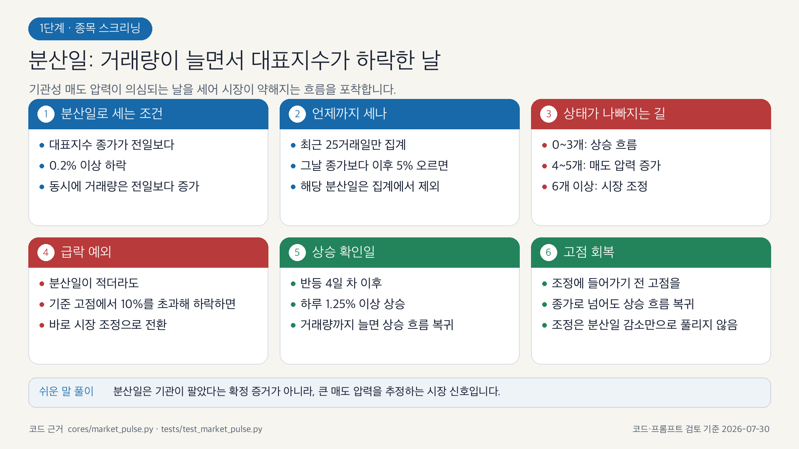
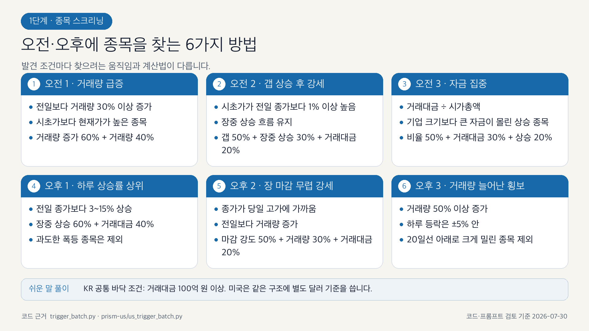
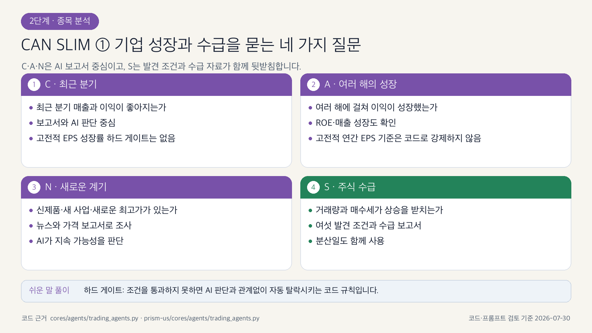
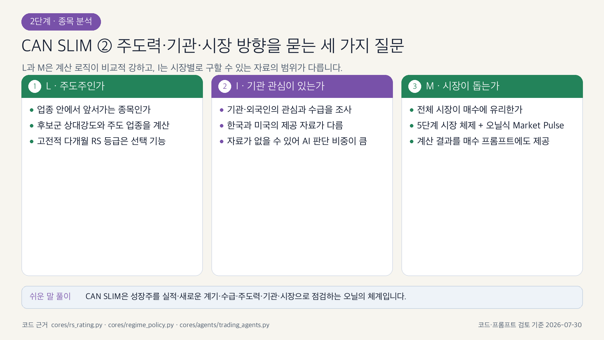
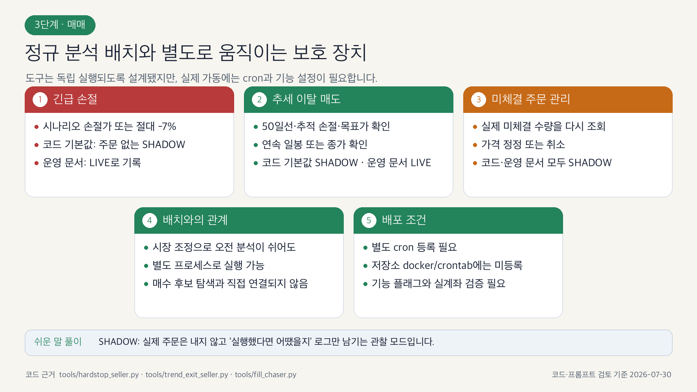

# PRISM-INSIGHT 4단계 투자 파이프라인

> 종목 스크리닝 → 종목 분석 → 매매 → 피드백의 흐름을 일반 투자자의 눈높이에서 설명합니다.

- 검증 기준: 2026-07-30
- 범위: 한국·미국 시장의 공통 흐름과 현재 코드·프롬프트
- 이미지 형식: 밝은 배경의 1920×1080 PNG

## 먼저 알아둘 점

이 문서의 그림은 단순한 아이디어 그림이 아닙니다. 각 그림의 문구를 코드,
프롬프트, 테스트와 대조했습니다. 다만 실제 주문 여부는 서버의 환경 변수와
스케줄 등록에 따라 달라질 수 있습니다. 그림 아래의 설명은 이 운영상 차이까지
포함한 현재 구현 기준입니다.

정확한 수치나 세부 규칙을 더 확인하려면 다음 문서를 함께 보십시오.

- [후보 선별·배치 알고리즘](TRIGGER_BATCH_ALGORITHMS.md)
- [AI 에이전트 시스템](CLAUDE_AGENTS_ko.md)
- [매매일지·메모리](TRADING_JOURNAL.md)
- [기능 플래그와 운영 상태](FEATURE_FLAGS.md)

## 전체 흐름

시스템은 먼저 시장이 매수에 유리한지 살피고 종목 후보를 찾습니다. 후보마다
가격·수급·실적·사업·뉴스·시장 환경을 조사한 뒤 매수나 매도를 판단합니다.
거래가 끝나면 결과와 이유를 기록해 다음 판단의 참고자료로 돌려보냅니다.

한국과 미국의 세부 데이터는 다르지만 이 네 단계의 큰 흐름은 같습니다.
텔레그램 전송, 실계좌 주문, 보호 도구는 설정에 따라 켜거나 끌 수 있습니다.

---

## 1단계. 종목 스크리닝

### 1.1 윌리엄 오닐의 M: 지금 시장이 매수에 유리한가

여기서 Market Pulse는 막연한 “시장 변동성”이 아닙니다. CAN SLIM의
M(Market Direction), 즉 **전체 시장이 주식을 사기에 유리한 방향인지**를
대표지수의 종가와 거래량으로 판단한 값입니다.

현재 코드는 시장을 세 상태로 나눕니다.

| 코드 상태 | 쉬운 표현 | 현재 배치 정책 |
|---|---|---|
| `UPTREND` | 상승 흐름 | 오전·오후 모두 실행 |
| `UNDER_PRESSURE` | 매도 압력 증가 | 오전·오후 모두 실행 |
| `CORRECTION` | 시장 조정 | 오전은 쉬고 오후는 실행 |

`MARKET_PULSE_MODE`의 코드 기본값은 `shadow`입니다. 이때는 상태를 계산하고
기록하지만 배치를 막지 않습니다. 운영 문서에는 `live`로 기록되어 있으므로
실제 서버에서는 배포 환경의 설정값을 확인해야 합니다. 계산에 실패하면
`UNKNOWN`으로 남기고 배치를 계속하는 `fail-open` 방식입니다.

코드 근거: `cores/market_pulse.py`, `cores/regime_policy.py`

### 1.2 분산일은 무엇이고, 어떻게 시장 상태를 바꾸나

분산일은 대표지수가 전일보다 0.2% 이상 내리고 거래량은 늘어난 날입니다.
기관이 실제로 팔았다고 확정하는 자료는 아니며, **큰 매도 압력이 있었을
가능성을 세는 시장 신호**입니다.

현재 구현은 최근 25거래일만 봅니다. 분산일 0~3개는 상승 흐름, 4~5개는
매도 압력 증가, 6개 이상은 시장 조정입니다. 특정 분산일의 종가보다 이후
지수가 5% 오르면 그 분산일은 집계에서 빠집니다.

두 가지 예외도 중요합니다.

- 분산일이 적어도 기준 고점에서 10%를 **초과해** 하락하면 시장 조정입니다.
- 조정에서 벗어나려면 반등 4일 차 이후 1.25% 이상 오르며 거래량도 늘어나는
  상승 확인일이 나오거나, 조정 전 고점을 종가로 회복해야 합니다.

거래량 자료가 없을 때 상승 확인일은 가격 조건만으로 판단하는 폴백이 있습니다.

코드 근거: `cores/market_pulse.py`, `tests/test_market_pulse.py`

### 1.3 오전 3개, 오후 3개의 서로 다른 발견 조건

여섯 조건은 같은 점수표에 이름만 바꾼 것이 아닙니다. 거래량 급증, 갭 상승,
시가총액 대비 자금 집중, 하루 상승률, 장 마감 무렵의 강세, 거래량이 늘어난
횡보처럼 서로 다른 움직임을 찾습니다.

한국 종목의 공통 바닥 조건은 거래대금 100억 원 이상입니다. 오전 거래량
급증은 전일 대비 30% 이상, 오후 거래량 횡보는 50% 이상 증가를 요구합니다.
하루 상승률 상위 조건은 3~15% 범위만 받기 때문에 이미 지나치게 폭등한
종목은 제외합니다.

미국도 같은 여섯 갈래를 사용하지만 달러 거래대금 등 시장별 기준값은
`prism-us/us_trigger_batch.py`에 따로 있습니다.

코드 근거: `trigger_batch.py`, `prism-us/us_trigger_batch.py`

### 1.4 후보를 다시 줄 세워 최대 3종목으로 압축

기본 여섯 조건 외에 주도 업종 대표주와 역발상 가치주가 상황에 따라 후보에
추가됩니다. 이후 다음 네 점수를 시장 체제에 맞는 비중으로 합칩니다.

1. 처음 종목을 발견한 조건의 점수
2. 예상 수익과 감수할 손실의 비율
3. 후보군 안에서의 상대강도
4. 20일 이동평균선에서 얼마나 멀리 과열됐는지

고전적인 다개월 오닐식 RS 등급은 기본적으로 `RS_RATING_ENABLED=true`로 실제
점수에 반영합니다. `false`로 내리면 기존 후보군 최근 수익률 비교 방식으로
긴급 롤백할 수 있습니다.

최종 상한은 보통 3종목입니다. 주도 업종 안의 강자와 업종과 무관한 개별
강자에게 시장 체제별로 자리를 나눕니다. post-FTD 파일럿이 켜진 직후에는
배치당 1종목으로 더 줄어들 수 있습니다.

코드 근거: `trigger_batch.py`, `prism-us/us_trigger_batch.py`,
`cores/rs_rating.py`

### 1.5 이름이 비슷한 두 시장 판단을 구분하기

PRISM에는 서로 목적이 다른 시장 분류가 두 개 있습니다.

- **오닐식 시장 매수 환경 3상태**는 오전·오후 분석을 실행할지 정합니다.
- **스크리닝용 시장 체제 5상태**는 후보 점수 비중과 주도 업종 자리를 정합니다.

5상태는 `strong_bull`, `moderate_bull`, `sideways`, `moderate_bear`,
`strong_bear`입니다. `parabolic`은 이 공통 분류의 여섯 번째 상태가 아니라,
강한 상승장에 추가 조건을 붙여 매수 프롬프트와 피라미딩 경로에서 사용하는
표현입니다.

코드 근거: `cores/regime_policy.py`, `trigger_batch.py`,
`cores/agents/trading_agents.py`

---

## 2단계. 종목 분석

### 2.1 한 종목을 여섯 방향에서 조사

최종 후보마다 주가·거래량, 투자 주체, 실적·재무, 사업·경쟁력, 뉴스·주도주,
시장·업종 보고서를 만듭니다. 그다음 투자전략과 핵심 요약을 조립합니다.

한국은 기관·외국인·개인 매매를 보고, 미국은 기관 보유 현황을 중심으로
봅니다. 뉴스 분석은 대상 종목만 검색하지 않고 같은 업종의 주도주 2~3개와
업종 흐름도 조사합니다. 이 조사는 분석의 질적 근거이며, 발견 단계의 점수에
숫자로 바로 더해지는 항목은 아닙니다.

KRX와 yfinance로 미리 모은 데이터를 우선 사용하고 부족한 부분을 웹 조사로
보완합니다. 기본적으로 보고서 순서를 보존하지만, 한국의 선택적 병렬 경로와
미국의 일부 겹침 실행도 있으므로 “항상 전부 순차 실행”이라고 보면 안 됩니다.

코드 근거: `cores/analysis.py`, `cores/report_generation.py`,
`cores/agents/`, `prism-us/cores/us_analysis.py`

### 2.2 CAN SLIM을 모두 구현했나

결론부터 말하면 **C·A·N·S·L·I·M 일곱 요소는 한국과 미국의 분석·매수
프롬프트에 모두 들어 있습니다.** 그러나 일곱 요소가 모두 똑같이 강한 코드
규칙으로 구현된 것은 아닙니다.

| 요소 | 현재 구현 | 강제 정도와 주의점 |
|---|---|---|
| C 최근 분기 | 분기 매출·이익과 실적 개선 조사 | AI 보고서 중심. 고전적 EPS 증가율은 하드 게이트가 아님 |
| A 여러 해의 성장 | 연간 이익·매출 성장과 ROE 조사 | AI 판단 중심. 고전적 연간 EPS 기준을 코드로 강제하지 않음 |
| N 새로운 계기 | 뉴스, 새 사업·제품, 신고가와 상승 동력 조사 | 여러 보고서를 조합한 AI 판단 |
| S 주식 수급 | 여섯 발견 조건, 거래량, 투자 주체 보고서 | 계산 로직과 보고서가 함께 있어 비교적 강함 |
| L 주도주 | 주도 업종, 후보군 상대강도, 선택적 다개월 RS | 상대강도 계산은 강함. 고전적 RS 등급은 기능 플래그 대상 |
| I 기관 관심 | 한국 수급·미국 기관 보유 자료 | 시장별 자료 차이가 크고 없을 수 있어 AI 판단 비중이 큼 |
| M 시장 방향 | 5상태 시장 체제와 오닐식 Market Pulse | 계산 결과가 매수 프롬프트와 배치 정책에 직접 연결됨 |

따라서 “CAN SLIM의 질문을 모두 다룬다”는 말은 맞지만, “오닐의 모든 수치
기준을 결정론적 코드로 완전히 자동화했다”는 말은 맞지 않습니다.

프롬프트 근거: `cores/agents/trading_agents.py`,
`prism-us/cores/agents/trading_agents.py`

---

## 3단계. 매매

### 3.1 신규 매수 전에 차례로 확인하는 것

AI는 여섯 분석 보고서, 종목 추세, 시장 체제·분산일, 과거 매매 경험을 받아
CAN SLIM 관점의 매수 시나리오를 만듭니다. 이후 코드는 최소점수, 하락 추세,
재진입 제한, 동일 종목 추가 매수, 업종 집중, 포트폴리오 자리, 진행 중 주문
등을 다시 확인합니다.

중요한 점은 최종 결과가 `Enter` 또는 `No Entry`라는 것입니다. 현재 매수
프롬프트는 별도의 “관심종목으로 대기” 결과를 요구하지 않습니다.

재진입 쿨다운은 기본적으로 관찰 모드입니다. `REENTRY_COOLDOWN_LIVE=true`일
때만 실제 차단 규칙이 됩니다.

코드 근거: `cores/agents/trading_agents.py`, `stock_tracking_agent.py`,
`reentry_cooldown.py`

### 3.2 추가 매수는 수익 중인 강한 종목에만

피라미딩은 손실 종목의 평균 매수가를 낮추는 물타기가 아닙니다. 다음 조건을
모두 통과한 보유 종목에만 추가 진입을 허용합니다.

- 시장 표현이 `strong_bull` 또는 `parabolic`
- 기존 보유 행의 단순 평균 매수가 대비 현재가 수익률 5% 이상
- 동일 종목 보유 행이 3개 미만, 즉 최초 1회와 추가 최대 2회
- 일반 매수 경로의 점수·업종·포트폴리오 조건도 별도로 통과

기본 포트폴리오 상한은 10행입니다. 동일 업종은 최대 3행이고, 전체 보유가
4행 이상이면 업종 비중 30% 제한도 적용합니다. post-FTD 파일럿의 첫
5거래일에는 신규 진입을 배치당 1종목으로 줄이고 피라미딩은 동결합니다.

코드 근거: `tracking/helpers.py`, `stock_tracking_agent.py`,
`cores/regime_policy.py`

### 3.3 매도는 급한 위험부터 처리

기업의 중대 사건과 즉시 손절 사유를 먼저 확인하고, 그 밖의 경우에는
추세·실적·뉴스·시장 변화를 함께 봅니다. 주요 결정론적 보호 규칙은 다음과
같습니다.

- 시나리오 손절가 또는 매수가 대비 절대 -7% 도달
- 손실 중 50일 이동평균선 이탈
- 수익이 난 뒤 고점 대비 추적 손절
- 약한 시장에서 목표가 도달

모든 규칙이 하나의 함수에서 위 순서대로만 실행되는 것은 아닙니다. 메인
추적 배치와 독립 보호 도구가 규칙을 나누어 소유하며, 연속 일봉 확인이나
종가 확인 같은 조건도 도구마다 다릅니다.

#### 손절 판정 기준이 도구마다 다르다 — 판단 로그를 읽을 때 주의

가장 헷갈리는 사례입니다. **손절 판정 기준을 두 주체가 다르게 씁니다.**

| 주체 | 실행 주기 | 판정 기준 | LLM |
|---|---|---|---|
| 메인 추적 배치 | 하루 2회 | **종가** | 사용 |
| `tools/hardstop_seller.py` | **5분** | **장중가** | 미사용(`skip_llm_agent=True`) |

프롬프트는 종가 기준을 명시적으로 지시합니다 —
`cores/agents/trading_agents.py:672` "하드 스탑: 종가 기준 stop_loss 이탈 시에만
전량 매도. 장중 wick(intraday low)으로 일시 이탈한 것은 매도 사유로 인정하지 않음",
같은 파일 `:970` "모든 손절가·trailing stop 판단은 종가 기준", US 는
`prism-us/cores/agents/trading_agents.py:688`, `:984-986`.

**그러나 5분 주기 `hardstop_seller` 가 장중가로 먼저 발동하므로, 실제 시스템은
장중 기준으로 움직입니다.** 두 주체 사이에 조율 장치는 없습니다.

그 결과 **AI 가 남긴 판단 로그가 실제 동작을 설명하지 못합니다.** 실제 사례 —
2026-07-31 IP(International Paper) 보유 판단은 "종가가 41.90달러 아래에서 마감하면
전량 매도" 라고 기록했지만, 실제로는 같은 날 **10:44 ET 에 장중가 41.57 로 청산**됐습니다
(종가는 41.71 로 역시 41.90 미만이라 방향 자체는 같았습니다).

`stock_holdings.scenario` 에 저장되는 매수 시점 시나리오도
`create_trading_scenario_agent` 가 같은 종가 기준 문구로 작성합니다
(`stock_tracking_agent.py:238`). **시나리오·판단 로그의 "종가 기준" 서술은
의도된 설계 문구이지 실제 청산 트리거가 아닙니다.**

> 측정 결과 **장중 기준이 종가 기준보다 우수**합니다. 실측 슬리피지(평균 2.08%)를
> 모두 반영해도 거래당 기대값이 +0.52pp 앞섰고, 슬리피지가 없다면 +2.11pp 입니다
> (신호 688건, 10슬랏, `tasks/exit_execution_quality_results.md`).
> 따라서 **현재 동작을 종가 기준으로 되돌리지 마십시오.** 프롬프트 문구를 실제 동작에
> 맞추는 수정은 손절가 산정 행동까지 바꿀 수 있어 의도적으로 보류했습니다.

코드 근거: `cores/oneil_fallback.py`, `stock_tracking_agent.py`,
`tools/trend_exit_seller.py`, `tools/hardstop_seller.py:278`

### 3.4 독립 보호 도구는 “코드가 있다”와 “운영 중이다”가 다르다

긴급 손절, 추세 이탈 매도, 미체결 주문 관리는 정규 종목 분석과 별도
프로세스로 실행할 수 있습니다. 따라서 시장 조정으로 오전 분석이 쉬더라도
독립적으로 작동하도록 설계됐습니다.

그러나 저장소의 `docker/crontab`에는 이 세 도구의 스케줄이 등록되어 있지
않습니다. 코드 기본값은 긴급 손절과 추세 이탈 매도가 `SHADOW`, 미체결
관리가 `SHADOW`입니다. 운영 문서는 앞의 두 기능을 `LIVE`로 기록하고 있어
실제 배포 서버의 cron과 환경 변수를 확인하지 않고 “항상 작동한다”고
단정해서는 안 됩니다.

**실측(2026-08-01, db-server):** 세 도구 모두 root crontab 에 등록되어 있고
`mode=LIVE` 로 동작합니다. 즉 저장소 파일과 운영 서버가 다릅니다 — 위 경고가
그대로 유효하다는 뜻입니다. 확인 시점의 KR 장중 스케줄은 다음과 같습니다.

| 도구 | 크론(분) | 최대 공백 |
|---|---|---|
| `hardstop_seller` | `0-50/10,6-56/10` | 6분 |
| `trend_exit_seller` | `2-52/10` | 10분 |
| `fill_chaser` | `1-59/2` (홀수분) | 2분 |

**분(minute) 오프셋 분리는 편의가 아니라 안전장치입니다.** `hardstop` 은
`loop_a_position_state`/`loop_a_inflight_orders`, `trend_exit` 은 `loop_b_*` 로
**락 네임스페이스가 분리**되어 서로의 락을 보지 못합니다. 두 도구가 같은 분에
돌면 동일 종목 동시 매도 경합이 생길 수 있으므로, 스케줄을 바꿀 때는 반드시
겹치지 않는 분을 배정해야 합니다. (US 는 `CRON_TZ=America/New_York` 로
분리되어 KR 장중과 겹치지 않습니다.)

코드 근거: `tools/hardstop_seller.py`, `tools/trend_exit_seller.py`,
`tools/fill_chaser.py`

---

## 4단계. 피드백

### 4.1 거래 기록이 다음 판단으로 돌아오는 과정

거래가 끝나면 매수·매도 가격, 수익률, 진입 근거, 청산 이유와 당시 상황을
저장합니다. 매매일지 에이전트는 계획과 실제 결과를 비교하고 잘한 점,
개선할 점, 반복되는 교훈을 정리합니다. 새 후보를 판단할 때 관련된 과거
경험을 찾아 매수·매도 프롬프트에 참고자료로 제공합니다.

이 과정은 자율 강화학습이 아닙니다. 시스템이 스스로 프롬프트나 주문 규칙을
수정해 배포하지 않습니다. 현재 데이터에 과거 경험을 덧붙여 다시 판단하며,
규칙 변경은 사람의 검토와 배포가 필요합니다.

최근 손실 매도 종목은 경과 시간과 반복 손절 이력을 확인해 성급한 재매수를
막을 수 있습니다. 다만 재진입 쿨다운은 기능 설정에 따라 관찰만 하거나
실제로 차단합니다.

한국은 pending exit, `CLOSED`, outbox와 `exit_intent_id`를 이용한 멱등성
보호가 있습니다. 미국 일지는 매도 트랜잭션이 확정된 뒤 생성되지만 동일한
outbox 계약은 없습니다. 공유 DB의 시장 구분과 일부 교훈 집계에는 알려진
제약이 있으므로 자세한 내용은
[매매일지 문서의 구현 제약](TRADING_JOURNAL.md#8-알려진-구현-제약)을
참조하십시오.

코드 근거: `tracking/journal.py`, `tracking/compression.py`,
`cores/agents/trading_journal_agent.py`, `reentry_cooldown.py`

---

## 단계별 진실 원천

| 단계 | 우선 확인할 코드 | 상세 문서 |
|---|---|---|
| 종목 스크리닝 | `trigger_batch.py`, `prism-us/us_trigger_batch.py`, `cores/market_pulse.py`, `cores/regime_policy.py` | [후보 선별·배치 알고리즘](TRIGGER_BATCH_ALGORITHMS.md) |
| 종목 분석 | `cores/analysis.py`, `cores/agents/`, `prism-us/cores/us_analysis.py` | [AI 에이전트 시스템](CLAUDE_AGENTS_ko.md) |
| 매매 | `stock_tracking_agent.py`, `prism-us/us_stock_tracking_agent.py`, `cores/oneil_fallback.py`, `tools/*seller.py` | [후보 선별·배치 알고리즘의 진입·매도 부분](TRIGGER_BATCH_ALGORITHMS.md#10-신규-진입-게이트) |
| 피드백 | `tracking/journal.py`, `tracking/compression.py`, `reentry_cooldown.py` | [매매일지·메모리](TRADING_JOURNAL.md) |

그림의 사실 관계를 수정할 때는 먼저
`tools/generate_pipeline_architecture_pngs.py`의 텍스트 명세를 고치고
`tests/test_pipeline_architecture_pngs.py`를 통과시켜야 합니다. 이 도구가
만드는 그림은 문구 검증용 초안이며, `docs/images/architecture`의 최종
인포그래픽을 덮어쓰면 안 됩니다. 최종 그림의 제작·검수 원칙은
[아키텍처 이미지 관리 안내](images/architecture/README.md)에 정리했습니다.
