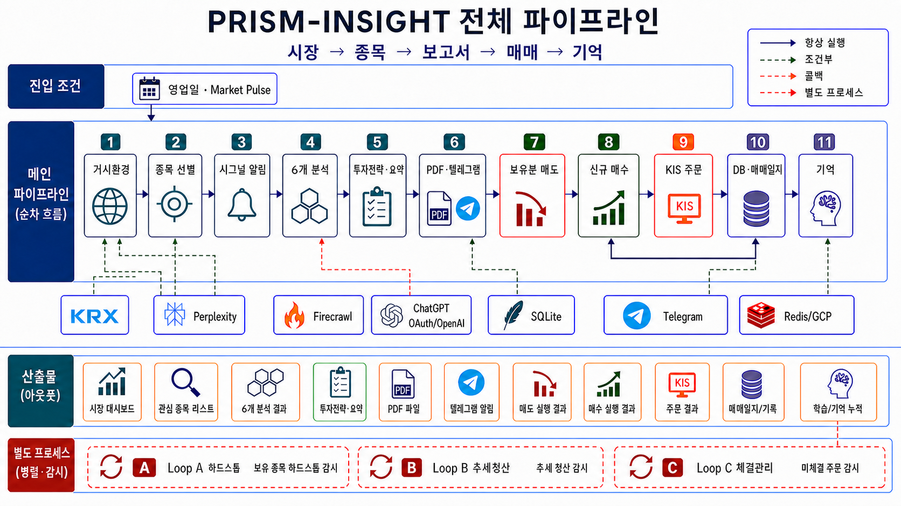
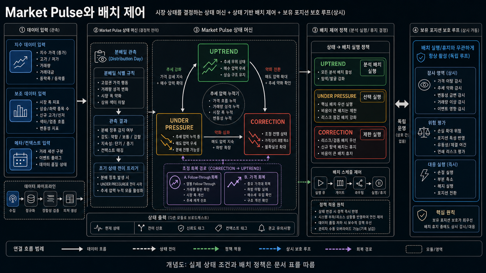
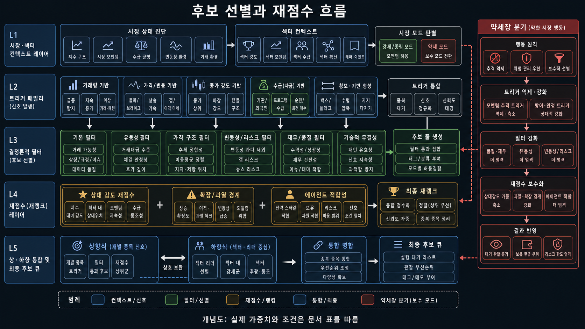
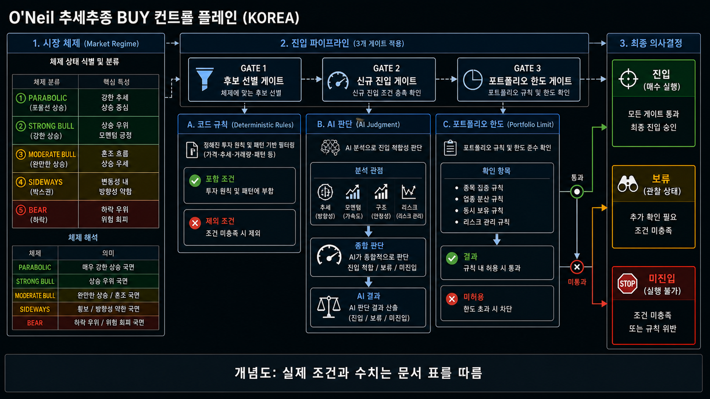
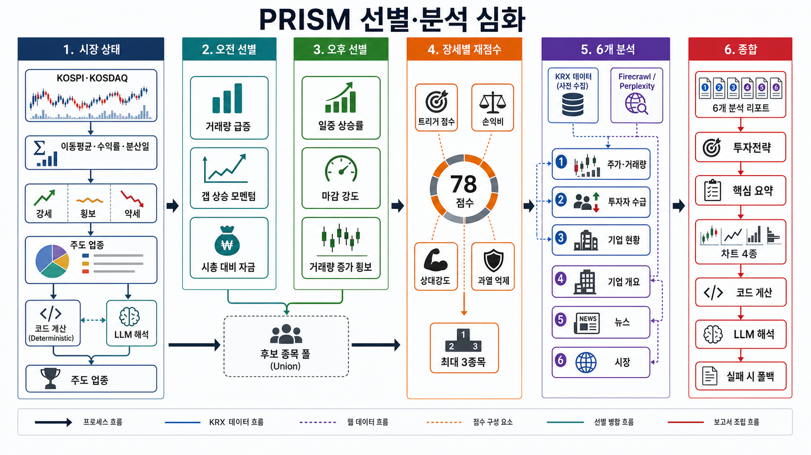
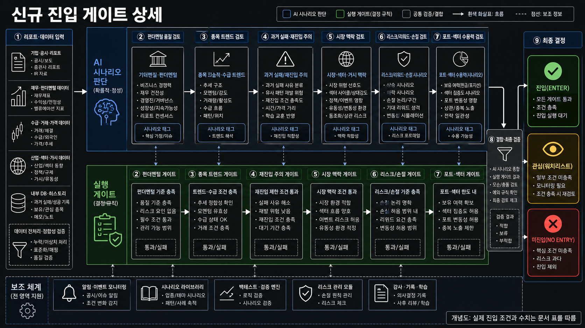
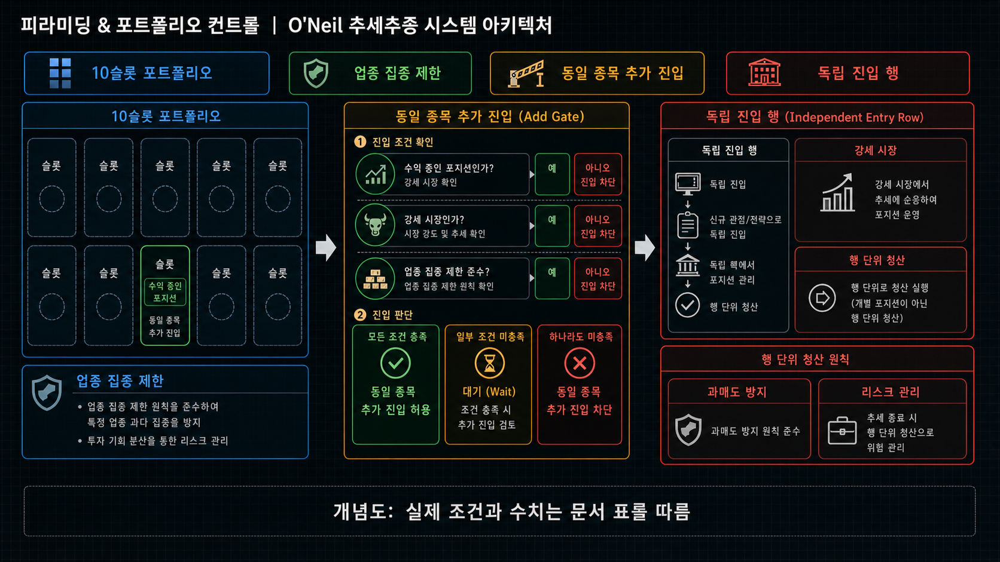
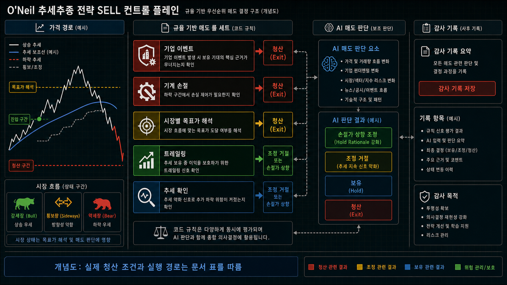
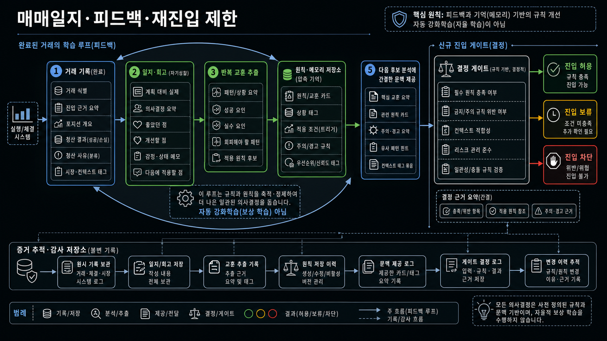

# PRISM-INSIGHT 4단계 파이프라인 아키텍처

> 종목 스크리닝 → 분석 → 매매 → 피드백의 흐름을 코드와 함께 읽는 설계 문서입니다.

**검증 기준**: 2026-07-29
**범위**: KR/US 공통 개념과 현재 구현 차이

## 문서 읽는 법

이 문서의 그림은 시스템을 이해하기 위한 개념도입니다. 그림에 적힌 “게이트 수”, “시장 체제 이름”, “항상 순차” 같은 표현이 반드시 하나의 함수나 enum과 일대일 대응하는 것은 아닙니다. 각 그림 아래의 **코드 대조 결과**가 실제 구현 계약입니다.

정확한 수치와 기능 플래그는 다음 문서를 우선합니다.

- [후보 선별·배치 알고리즘](TRIGGER_BATCH_ALGORITHMS.md)
- [AI 에이전트 시스템](CLAUDE_AGENTS_ko.md)
- [매매일지·메모리](TRADING_JOURNAL.md)

## 전체 개요



개념적으로는 시장 상태를 관측한 뒤 후보를 고르고, 종목 보고서를 만들고, 보유 종목 매도와 신규 매수를 처리하고, 결과를 DB·일지·메모리에 남깁니다.

코드 대조 결과:

- 최상위 KR/US 오케스트레이터는 거시 조사 → 선별 → 종목별 보고서 → PDF/텔레그램 → 추적·매매 순으로 진행합니다.
- 한 종목의 주요 보고서 섹션은 KR에서 기본 순차 실행입니다. 다만 `PRISM_PARALLEL_REPORT=true` 경로가 존재하고, US는 뉴스 조사를 데이터 기반 섹션과 겹쳐 실행합니다.
- hard stop, trend exit, 미체결 조정은 메인 분석 배치와 독립적으로 실행될 수 있는 보호 루프입니다.
- Telegram, Redis/GCP, KIS 주문은 모두 설정에 따라 선택적입니다.

---

## 1단계. 종목 스크리닝

### 1.1 Market Pulse가 배치 실행 여부를 결정



Market Pulse는 `UPTREND`, `UNDER_PRESSURE`, `CORRECTION`의 3상태를 사용합니다. 선별용 5상태 체제와 별개입니다.

코드 대조 결과:

- 구현: `cores/market_pulse.py`, `cores/regime_policy.py`
- 기본은 `MARKET_PULSE_MODE=shadow`이므로 상태를 기록해도 배치를 막지 않습니다.
- `live`에서 `CORRECTION`이면 KR/US 오전 배치를 쉬고 오후 배치는 유지합니다.
- `UNDER_PRESSURE`는 현재 “선택 실행”이 아니라 오전·오후 모두 실행합니다.
- 그림의 “비용이 큰 배치 휴지”는 개념 설명이며, 실제 정책은 시장·세션 표로 정의됩니다.
- 보유 포지션 보호 루프는 배치 휴지와 독립적입니다.

### 1.2 시장·업종 컨텍스트와 후보 재점수



선별은 다섯 층으로 이해할 수 있습니다.

1. 시장 체제와 주도 업종을 계산·조사합니다.
2. 오전/오후 및 추가 트리거가 신호를 냅니다.
3. 유동성·가격구조·재무·기술 필터로 후보군을 만듭니다.
4. agent fit, 상대강도, 과열·확장도를 체제별 가중치로 재점수합니다.
5. 탑다운 업종 후보와 바텀업 종목 후보를 통합합니다.

코드 대조 결과:

- 구현: `trigger_batch.py`, `prism-us/us_trigger_batch.py`
- 결정론적 선별 체제는 `strong_bull`, `moderate_bull`, `sideways`, `moderate_bear`, `strong_bear`입니다.
- 그림 오른쪽의 약세장 조정은 하나의 함수가 아니라 체제별 가중치, 추가 트리거 활성, 탑다운 슬롯, 선택적 최소점수 플래그의 합성 결과입니다.
- 기본 최종 후보는 최대 3개입니다. 후보 부족, `REGIME_WEAK_NO_TOPDOWN`, post-FTD pilot 때문에 2개 또는 1개가 될 수 있습니다.
- 실제 재점수 가중치는 [후보 선별·배치 알고리즘](TRIGGER_BATCH_ALGORITHMS.md#73-체제별-혼합-가중치)을 따릅니다.

### 1.3 선별 체제가 매수까지 전달되는 방식



그림은 시장 체제 → 후보 게이트 → AI 진입 판단 → 포트폴리오 제한 → 최종 결정을 한 장에 연결합니다.

코드 대조 결과:

- 그림의 `PARABOLIC/STRONG BULL/MODERATE BULL/SIDEWAYS/BEAR`는 개념적 분류입니다.
- 실제 선별 체제는 5상태 소문자 키이며, Market Pulse는 또 다른 3상태 체계입니다.
- 피라미딩 경로에서는 `parabolic` 표현도 사용되므로 모든 파일이 하나의 enum을 공유한다고 가정하면 안 됩니다.
- 시장 체제는 재점수 가중치, 탑다운/바텀업 슬롯, 선택적 최소 매수점수, 피라미딩 허용에 영향을 줍니다.
- “게이트 3개”는 이해를 위한 묶음이며 실제 코드는 후보·점수·재진입·섹터·슬롯·주문 상태 등을 여러 위치에서 확인합니다.

---

## 2단계. 종목 분석



최종 후보는 종목별 보고서 파이프라인으로 넘어갑니다.

KR 기본 섹션:

1. 주가·거래량
2. 투자자 수급
3. 기업 현황
4. 기업 개요
5. 최근 뉴스·동종 주도주
6. 시장 지수

US는 투자자 수급 대신 기관 보유 분석을 사용합니다. 기본 섹션이 끝나면 공유 `investment_strategy_agent`와 `summary_agent`를 인라인으로 생성해 투자전략과 핵심 요약을 조립합니다.

코드 대조 결과:

- KR 구현: `cores/analysis.py`, `cores/report_generation.py`, `cores/agents/`
- US 구현: `prism-us/cores/us_analysis.py`, `prism-us/cores/agents/`
- KRX/yfinance 사전 수집 데이터를 우선하고 필요할 때 MCP를 폴백으로 사용합니다.
- 뉴스 에이전트는 대상 종목의 최근 뉴스뿐 아니라 같은 업종 주도주 2~3개와 업종 추세를 조사합니다.
- 이 주도주 조사는 매수 판단의 질적 근거이며 트리거 재점수에 곧바로 합산되는 숫자는 아닙니다.
- 그림의 “최대 3종목”은 기본 상한입니다. 체제 pilot과 후보 부족 예외가 있습니다.
- 그림의 “실패 시 폴백”은 섹션별 오류 처리·플레이스홀더·캐시/MCP 폴백을 묶어 표현한 것입니다.

분석 실행 타입과 모델은 [AI 에이전트 시스템](CLAUDE_AGENTS_ko.md)을 참조하십시오.

---

## 3단계. 매매

### 3.1 신규 진입 판단



분석 보고서와 시장·포트폴리오·과거 거래 데이터를 함께 사용해 `진입`, `관심/보류`, `미진입`을 결정합니다.

코드 대조 결과:

- 그림의 7개 항목은 설명용 분류입니다. 실제 구현은 하나의 7단계 함수가 아닙니다.
- LLM 시나리오가 펀더멘털, 추세, 시장 맥락, 위험, 과거 교훈을 평가합니다.
- 결정론적 코드는 `Enter` 여부, 최소점수, 섹터 다양성, 재진입 쿨다운, 피라미딩, 미체결 상태, 포트폴리오 슬롯을 별도로 검사합니다.
- KR은 `buy_score`, US는 저널 조정이 반영된 `adjusted_score`를 최종 점수 게이트에 사용합니다.
- 재진입 쿨다운은 기본 SHADOW이며 live 플래그를 켜야 차단됩니다.
- 실제 모든 게이트가 “적합/보류/부적합” 3값을 동일하게 반환하는 것은 아닙니다. 최종 UI 의미를 도식화한 것입니다.

### 3.2 피라미딩과 포트폴리오



코드 대조 결과:

- 기본 최대 보유 행/슬롯은 10개입니다.
- 동일 섹터 최대 3개, 보유 4개 이상이면 섹터 비중 30% 제한을 사용합니다.
- 동일 종목 추가 진입은 별도 행으로 저장됩니다.
- 추가 진입은 `strong_bull` 또는 `parabolic`, 기존 평균 수익률 5% 이상, 기존 행 3개 미만을 요구합니다.
- post-FTD pilot에서는 피라미딩을 동결합니다.
- 그림의 “수익 중·강세 시장·업종 제한”보다 실제 게이트가 더 구체적입니다.
- KR/US의 섹터 제한과 추가 진입 처리에는 세부 차이가 있으므로 [후보 선별·배치 알고리즘](TRIGGER_BATCH_ALGORITHMS.md#11-피라미딩)을 우선합니다.

### 3.3 매도 제어



매도는 결정론적 위험 규칙과 AI 보조 판단을 결합합니다.

코드 대조 결과:

- 공용 폴백: `cores/oneil_fallback.py`
- 독립 hard stop: `tools/hardstop_seller.py`
- 독립 trend exit: `tools/trend_exit_seller.py`
- 핵심 결정론 규칙에는 시나리오 손절, 절대 -7%, 손실 중 MA50 이탈, +5% 이후 트레일링, 약세 체제 목표가 청산이 포함됩니다.
- hard stop과 trend exit의 live 강제는 기본 비활성/SHADOW이며, 피라미딩 행은 독립 루프에서 제외됩니다.
- 그림의 “기업 이벤트 → 기계 손절 → 목표가 → 트레일링 → 추세” 순서는 우선순위 개념입니다. 실제로는 여러 규칙이 함께 평가되고 배치/독립 루프마다 소유 범위가 다릅니다.
- 감사 기록은 규칙 신호, AI 입력·판단, 최종 결정과 상태 변화를 재현할 수 있도록 남깁니다.

---

## 4단계. 피드백



완료된 거래는 다음 판단에 사용할 수 있는 근거로 바뀝니다.

```text
청산 기록
  -> 일지·회고
  -> 교훈/원칙
  -> 직관/패턴 압축
  -> 다음 후보 프롬프트
  -> 점수 조정 + 재진입 쿨다운
```

코드 대조 결과:

- 구현: `tracking/journal.py`, `tracking/compression.py`, `reentry_cooldown.py` 및 US mirror
- KR pending-exit은 `CLOSED` 후 outbox와 `exit_intent_id` 멱등성을 사용합니다.
- US 일지는 매도 트랜잭션 커밋 후 생성하지만 동일한 outbox 계약은 없습니다.
- 원칙은 새 일지에서 즉시 추출될 수 있고, 직관은 압축 단계에서 생성·갱신됩니다.
- 최근 동일 종목 청산은 프롬프트 경고, 48시간 점수 패널티, 선택적 live 쿨다운에 반영됩니다.
- 재진입 쿨다운은 기본적으로 기록·관찰(SHADOW)되며 `REENTRY_COOLDOWN_LIVE=true`일 때 강제됩니다.
- 그림이 명시하듯 자율 강화학습이 아닙니다. 사전 정의 규칙과 LLM 문맥 제공을 개선하는 피드백 루프입니다.
- 공유 DB의 KR/US market 격리와 `supporting_trades`/`supporting_count`에는 현재 알려진 구현 위험이 있습니다. 자세한 내용은 [매매일지 문서](TRADING_JOURNAL.md#8-알려진-구현-제약)를 참조하십시오.

---

## 단계별 진실 원천

| 단계 | 우선 읽을 코드 | 상세 문서 |
|---|---|---|
| 스크리닝 | `trigger_batch.py`, `prism-us/us_trigger_batch.py`, `cores/market_pulse.py`, `cores/regime_policy.py` | [TRIGGER_BATCH_ALGORITHMS.md](TRIGGER_BATCH_ALGORITHMS.md) |
| 분석 | `cores/analysis.py`, `cores/report_generation.py`, `prism-us/cores/us_analysis.py` | [CLAUDE_AGENTS_ko.md](CLAUDE_AGENTS_ko.md) |
| 매매 | `stock_tracking_enhanced_agent.py`, `prism-us/us_stock_tracking_agent.py`, `cores/oneil_fallback.py` | [TRIGGER_BATCH_ALGORITHMS.md](TRIGGER_BATCH_ALGORITHMS.md#10-신규-진입-게이트) |
| 피드백 | `tracking/journal.py`, `tracking/compression.py`, `reentry_cooldown.py` | [TRADING_JOURNAL.md](TRADING_JOURNAL.md) |

## 이미지 검증 요약

| 이미지 | 판정 | 반드시 함께 읽을 보정 |
|---|---|---|
| 전체 파이프라인 | 단계 수준 정확 | KR 선택적 병렬·US hybrid, 독립 보호 루프 |
| Market Pulse | 개념 정확 | 실제 `CORRECTION`은 오전만 휴지, 기본 SHADOW |
| 후보 재점수 | 개념 정확 | 체제별 실제 가중치·RS 플래그·최대 3 예외 |
| 선별·분석 심화 | 대체로 정확 | US 섹션 차이, 주도주 조사는 질적 근거 |
| 체제→매수 | 개념 정확 | 5상태와 Pulse 3상태를 혼동하지 않기 |
| 신규 진입 | 범주 설명용 | 실제 단일 7게이트 구현은 없음 |
| 피라미딩 | 핵심 정확 | 5%·3행 미만·허용 체제·pilot 동결 추가 |
| 매도 | 우선순위 설명용 | 배치와 독립 루프의 소유 규칙 차이 |
| 피드백 | 개념 정확 | 기본 SHADOW, KR/US 멱등성·압축 차이 |
